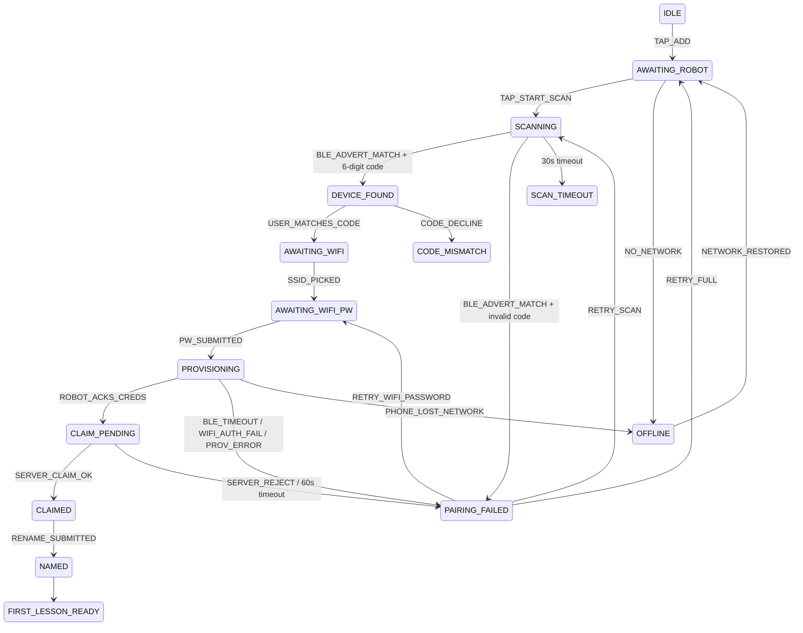

# Device Pairing Runtime Flow Implementation Plan

> **SUPERSEDED by G13 (2026-06-30 robot Android production-readiness work).**
> Do not implement this plan as written. The current pairing runtime source of
> truth is the `Pair*Screen` flow plus `claimEntryPoints.ts`, not a restored
> `devicePairingMachine`. The old `E-PROV` / `ProvisioningErrorCode` taxonomy
> and `CLAIM_PENDING` 60s machine timeout are historical only; current runtime
> docs and tests use the G07 claim taxonomy plus the real 3000ms poll / 300s
> confirm behavior.

> **For agentic workers:** REQUIRED SUB-SKILL: Use superpowers:subagent-driven-development (recommended) or superpowers:executing-plans to implement this plan task-by-task. Steps use checkbox (`- [ ]`) syntax for tracking.

**Goal:** Make TJBot mobile pairing feel certain: parent always knows whether phone is finding Robot, checking BLE code, sending Wi-Fi, waiting for Robot online, recovering from failure, or managing runtime status.

**Architecture:** Keep `devicePairingMachine` as source of truth, then make pairing screens render from typed view models instead of static mock timers. Add copy through existing exact-string i18n catalogs, keep BLE/sys-18 protocol read-only, and map canonical device runtime states into parent-readable status surfaces.

**Tech Stack:** React Native 0.83, React Navigation 7, XState 5, Jest 29, `@testing-library/react-native`, existing i18next exact-string catalogs.

---

## File Structure

- Modify `src/state/machines/devicePairing.types.ts`: add 6-digit code shape, code expiry, Wi-Fi validation, and retry target metadata.
- Modify `src/state/machines/devicePairing.machine.ts`: add code validation events, password validation guards, specific recovery transitions, and online-wait state behavior.
- Create `src/features/device/pairing/pairingCopy.ts`: typed EN literals used by pairing screens and tests.
- Create `src/features/device/pairing/pairingStatus.ts`: error-code to parent-facing recovery mapping.
- Create `src/features/device/pairing/useDevicePairingFlow.ts`: hook wrapping machine state and screen commands.
- Modify pairing screens under `src/features/device/pairing/screens/`: replace static mock flow with hook-driven state, 6-digit code UI, password show/hide, validation, and specific retries.
- Create `src/features/device/runtime/deviceStatus.ts`: canonical device state to DeviceHome/DeviceLost/DeviceFirmware status view model.
- Modify `src/features/device/screens/DeviceHomeScreen.tsx`, `DeviceLostScreen.tsx`, `DeviceFirmwareScreen.tsx`, `DeviceSessionScreen.tsx`: render status matrix and non-blocking offline/lost/update language.
- Modify `src/services/i18n/locales/en.json` and `src/services/i18n/locales/vi.json`: add EN/VI pairing/runtime copy.
- Modify docs generated/hand-authored surfaces as required by doc sync: `migrate-ui-ux-to-mobile-app-docs/state-machines/device-pairing.state.mmd` if state transitions change, and QA evidence file under `migrate-ui-ux-to-mobile-app-docs/qa/ad-hoc/`.
- Add tests:
  - `tests/state/machines/devicePairing.machine.test.ts`
  - `tests/features/device/pairingStatus.test.ts`
  - `tests/features/device/deviceStatus.test.ts`
  - `tests/features/device/pairing-screens.test.tsx`
  - `tests/i18n/device-pairing-copy.test.ts`

## Task 1: Lock Machine Contract For 6-Digit Pairing And Recovery

**Files:**
- Modify: `src/state/machines/devicePairing.types.ts`
- Modify: `src/state/machines/devicePairing.machine.ts`
- Test: `tests/state/machines/devicePairing.machine.test.ts`

- [ ] **Step 1: Write failing tests for 6-digit code, expiry, and specific recovery**

Add these tests to `tests/state/machines/devicePairing.machine.test.ts`:

```ts
describe('6-digit verification code', () => {
  it('stores a 6-digit display code from BLE advert', () => {
    const actor = makeActor();
    actor.send({ type: 'TAP_ADD' });
    actor.send({ type: 'TAP_START_SCAN' });
    actor.send({ type: 'BLE_ADVERT_MATCH', serial: 'TJBot-008', displayCode: '123456' });

    expect(actor.getSnapshot().value).toBe('DEVICE_FOUND');
    expect(actor.getSnapshot().context.displayCode).toBe('123456');
  });

  it('rejects a short display code as a provisioning error', () => {
    const actor = makeActor();
    actor.send({ type: 'TAP_ADD' });
    actor.send({ type: 'TAP_START_SCAN' });
    actor.send({ type: 'BLE_ADVERT_MATCH', serial: 'TJBot-009', displayCode: '1234' });

    expect(actor.getSnapshot().value).toBe('PAIRING_FAILED');
    expect(actor.getSnapshot().context.errorCode).toBe('E-PROV-003');
  });
});

describe('failure-specific recovery', () => {
  it('Wi-Fi auth failure retries at password entry with SSID preserved and password wiped', () => {
    const actor = makeActor();
    actor.send({ type: 'TAP_ADD' });
    actor.send({ type: 'TAP_START_SCAN' });
    actor.send({ type: 'BLE_ADVERT_MATCH', serial: 'TJBot-010', displayCode: '654321' });
    actor.send({ type: 'USER_MATCHES_CODE' });
    actor.send({ type: 'SSID_PICKED', ssid: 'Casa-Familia' });
    actor.send({ type: 'PW_SUBMITTED', password: 'badpass12' });
    actor.send({ type: 'WIFI_AUTH_FAIL' });

    expect(actor.getSnapshot().value).toBe('PAIRING_FAILED');
    expect(actor.getSnapshot().context.ssid).toBe('Casa-Familia');
    expect(actor.getSnapshot().context.password).toBeNull();

    actor.send({ type: 'RETRY_WIFI_PASSWORD' });
    expect(actor.getSnapshot().value).toBe('AWAITING_WIFI_PW');
    expect(actor.getSnapshot().context.errorCode).toBeNull();
  });
});
```

- [ ] **Step 2: Run machine tests and verify failure**

Run:

```bash
npm test -- tests/state/machines/devicePairing.machine.test.ts
```

Expected: FAIL because `RETRY_WIFI_PASSWORD` is not in `DevicePairingEvent`, and short display codes currently enter `DEVICE_FOUND`.

- [ ] **Step 3: Update types**

In `src/state/machines/devicePairing.types.ts`, change advert and recovery events:

```ts
export type DevicePairingEvent =
  | { type: 'TAP_ADD' }
  | { type: 'TAP_START_SCAN' }
  | { type: 'NO_NETWORK' }
  | { type: 'NETWORK_RESTORED' }
  | { type: 'BLE_ADVERT_MATCH'; serial: string; displayCode: string }
  | { type: 'USER_MATCHES_CODE' }
  | { type: 'CODE_DECLINE' }
  | { type: 'SSID_PICKED'; ssid: string }
  | { type: 'PW_SUBMITTED'; password: string }
  | { type: 'BACK' }
  | { type: 'ROBOT_ACKS_CREDS' }
  | { type: 'BLE_TIMEOUT' }
  | { type: 'WIFI_AUTH_FAIL' }
  | { type: 'PROV_ERROR'; errorCode: ProvisioningErrorCode }
  | { type: 'PHONE_LOST_NETWORK' }
  | { type: 'SERVER_CLAIM_OK'; deviceId: string }
  | { type: 'SERVER_REJECT'; errorCode: ProvisioningErrorCode }
  | { type: 'RENAME_SUBMITTED'; name: string }
  | { type: 'RETRY_SCAN' }
  | { type: 'RETRY_WIFI_PASSWORD' }
  | { type: 'RETRY_FULL' }
  | { type: 'GIVE_UP' }
  | { type: 'CANCEL' };
```

- [ ] **Step 4: Add guards and recovery transition**

In `src/state/machines/devicePairing.machine.ts`, add guard and invalid-code transition:

```ts
guards: {
  blePermGranted: () => true,
  hasSixDigitCode: (_, params: { displayCode: string }) => /^\d{6}$/.test(params.displayCode),
},
```

Replace `BLE_ADVERT_MATCH` in `SCANNING`:

```ts
BLE_ADVERT_MATCH: [
  {
    target: 'DEVICE_FOUND',
    guard: {
      type: 'hasSixDigitCode',
      params: ({ event }) => ({ displayCode: event.displayCode }),
    },
    actions: {
      type: 'assignDeviceFound',
      params: ({ event }) => ({ serial: event.serial, displayCode: event.displayCode }),
    },
  },
  {
    target: 'PAIRING_FAILED',
    actions: {
      type: 'assignErrorCode',
      params: { errorCode: 'E-PROV-003' as ProvisioningErrorCode },
    },
  },
],
```

Add `RETRY_WIFI_PASSWORD` in `PAIRING_FAILED`:

```ts
RETRY_WIFI_PASSWORD: {
  target: 'AWAITING_WIFI_PW',
  actions: 'clearErrorCode',
},
```

- [ ] **Step 5: Run machine tests**

Run:

```bash
npm test -- tests/state/machines/devicePairing.machine.test.ts
```

Expected: PASS, non-zero test count.

- [ ] **Step 6: Commit**

```bash
git add src/state/machines/devicePairing.types.ts src/state/machines/devicePairing.machine.ts tests/state/machines/devicePairing.machine.test.ts
git commit -m "fix(device): harden pairing machine recovery"
```

## Task 2: Add Pairing Recovery And Runtime Status View Models

**Files:**
- Create: `src/features/device/pairing/pairingStatus.ts`
- Create: `src/features/device/runtime/deviceStatus.ts`
- Test: `tests/features/device/pairingStatus.test.ts`
- Test: `tests/features/device/deviceStatus.test.ts`

- [ ] **Step 1: Write failing recovery mapping tests**

Create `tests/features/device/pairingStatus.test.ts`:

```ts
import { getPairingRecovery } from '../../../src/features/device/pairing/pairingStatus';

describe('getPairingRecovery', () => {
  it('maps Wi-Fi auth failure to password retry without blame', () => {
    expect(getPairingRecovery('E-PROV-002')).toEqual({
      title: 'Robot could not join that Wi-Fi',
      body: 'Check the password or choose a different home network.',
      primaryAction: 'Re-enter password',
      primaryEvent: 'RETRY_WIFI_PASSWORD',
      secondaryAction: 'Choose another network',
      secondaryEvent: 'RETRY_FULL',
    });
  });

  it('maps BLE timeout to moving closer and scan retry', () => {
    expect(getPairingRecovery('E-PROV-001').primaryEvent).toBe('RETRY_SCAN');
    expect(getPairingRecovery('E-PROV-001').body).not.toMatch(/failed|invalid|wrong/i);
  });
});
```

- [ ] **Step 2: Write failing runtime status tests**

Create `tests/features/device/deviceStatus.test.ts`:

```ts
import { getDeviceStatusView } from '../../../src/features/device/runtime/deviceStatus';

describe('getDeviceStatusView', () => {
  it('keeps offline device home usable', () => {
    expect(getDeviceStatusView({ state: 'OFFLINE_LIMITED', batteryPercent: 78, lastSeenMinutesAgo: 12 })).toEqual({
      label: 'Offline',
      headline: 'Robot is offline',
      body: 'You can keep using the app. Status updates when Robot reconnects.',
      tone: 'warning',
      blocksLessonStart: true,
      allowsDeviceHome: true,
      primaryAction: 'Check connection',
    });
  });

  it('maps active lesson states to live labels', () => {
    expect(getDeviceStatusView({ state: 'LISTENING' }).label).toBe('Listening');
    expect(getDeviceStatusView({ state: 'THINKING' }).label).toBe('Thinking');
    expect(getDeviceStatusView({ state: 'SPEAKING' }).label).toBe('Speaking');
  });
});
```

- [ ] **Step 3: Run tests and verify failure**

Run:

```bash
npm test -- tests/features/device/pairingStatus.test.ts tests/features/device/deviceStatus.test.ts
```

Expected: FAIL because modules do not exist.

- [ ] **Step 4: Create pairing status module**

Create `src/features/device/pairing/pairingStatus.ts`:

```ts
import type { DevicePairingEvent, ProvisioningErrorCode } from '@/state/machines/devicePairing.types';

type RecoveryEvent = Extract<
  DevicePairingEvent['type'],
  'RETRY_SCAN' | 'RETRY_WIFI_PASSWORD' | 'RETRY_FULL' | 'GIVE_UP'
>;

export interface PairingRecovery {
  title: string;
  body: string;
  primaryAction: string;
  primaryEvent: RecoveryEvent;
  secondaryAction: string;
  secondaryEvent: RecoveryEvent;
}

export function getPairingRecovery(errorCode: ProvisioningErrorCode | null): PairingRecovery {
  switch (errorCode) {
    case 'E-PROV-001':
      return {
        title: 'Robot moved out of range',
        body: 'Move your phone closer to Robot and search again.',
        primaryAction: 'Search again',
        primaryEvent: 'RETRY_SCAN',
        secondaryAction: 'Start over',
        secondaryEvent: 'RETRY_FULL',
      };
    case 'E-PROV-002':
      return {
        title: 'Robot could not join that Wi-Fi',
        body: 'Check the password or choose a different home network.',
        primaryAction: 'Re-enter password',
        primaryEvent: 'RETRY_WIFI_PASSWORD',
        secondaryAction: 'Choose another network',
        secondaryEvent: 'RETRY_FULL',
      };
    case 'E-PROV-004':
      return {
        title: 'Robot is linked to another home',
        body: 'Use a different Robot or contact support for help moving this one.',
        primaryAction: 'Search again',
        primaryEvent: 'RETRY_SCAN',
        secondaryAction: 'Stop setup',
        secondaryEvent: 'GIVE_UP',
      };
    case 'E-PROV-003':
    case 'E-PROV-005':
    case null:
      return {
        title: 'Robot needs another try',
        body: 'Keep Robot close to your phone and start setup again.',
        primaryAction: 'Try again',
        primaryEvent: 'RETRY_FULL',
        secondaryAction: 'Stop setup',
        secondaryEvent: 'GIVE_UP',
      };
  }
}
```

- [ ] **Step 5: Create runtime status module**

Create `src/features/device/runtime/deviceStatus.ts`:

```ts
export type CanonicalDeviceState =
  | 'UNPROVISIONED'
  | 'PROVISIONING'
  | 'IDLE_READY'
  | 'LISTENING'
  | 'THINKING'
  | 'SPEAKING'
  | 'OFFLINE_LIMITED'
  | 'QUIET_MODE'
  | 'OTA_PENDING'
  | 'SAFE_MODE'
  | 'DECOMMISSIONED';

export interface DeviceStatusInput {
  state: CanonicalDeviceState;
  batteryPercent?: number;
  lastSeenMinutesAgo?: number;
}

export interface DeviceStatusView {
  label: string;
  headline: string;
  body: string;
  tone: 'good' | 'warning' | 'danger' | 'neutral';
  blocksLessonStart: boolean;
  allowsDeviceHome: boolean;
  primaryAction: string;
}

export function getDeviceStatusView(input: DeviceStatusInput): DeviceStatusView {
  switch (input.state) {
    case 'UNPROVISIONED':
      return status('Not set up', 'Set up Robot', 'Pair Robot before starting lessons.', 'neutral', true, true, 'Set up Robot');
    case 'PROVISIONING':
      return status('Setting up', 'Setup in progress', 'Finish setup to bring Robot online.', 'neutral', true, true, 'Resume setup');
    case 'IDLE_READY':
      return status('Online', 'Ready for today', 'Robot is ready for lessons.', 'good', false, true, 'Start lesson');
    case 'LISTENING':
      return status('Listening', 'Lesson in progress', 'Robot is listening now.', 'good', false, true, 'View session');
    case 'THINKING':
      return status('Thinking', 'Lesson in progress', 'Robot is preparing a response.', 'good', false, true, 'View session');
    case 'SPEAKING':
      return status('Speaking', 'Lesson in progress', 'Robot is speaking now.', 'good', false, true, 'View session');
    case 'OFFLINE_LIMITED':
      return status('Offline', 'Robot is offline', 'You can keep using the app. Status updates when Robot reconnects.', 'warning', true, true, 'Check connection');
    case 'QUIET_MODE':
      return status('Quiet hours', 'Robot is resting', 'Lessons can start after quiet hours.', 'neutral', true, true, 'Edit quiet hours');
    case 'OTA_PENDING':
      return status('Updating', 'Software update ready', 'Robot may be unavailable for a few minutes during update.', 'warning', true, true, 'Review update');
    case 'SAFE_MODE':
      return status('Needs help', 'Robot needs attention', 'Robot is in a protected mode. Support can help.', 'danger', true, true, 'Contact support');
    case 'DECOMMISSIONED':
      return status('Unpaired', 'Robot is no longer linked', 'Set up another Robot when ready.', 'neutral', true, false, 'Set up Robot');
  }
}

function status(
  label: string,
  headline: string,
  body: string,
  tone: DeviceStatusView['tone'],
  blocksLessonStart: boolean,
  allowsDeviceHome: boolean,
  primaryAction: string,
): DeviceStatusView {
  return { label, headline, body, tone, blocksLessonStart, allowsDeviceHome, primaryAction };
}
```

- [ ] **Step 6: Run status tests**

Run:

```bash
npm test -- tests/features/device/pairingStatus.test.ts tests/features/device/deviceStatus.test.ts
```

Expected: PASS.

- [ ] **Step 7: Commit**

```bash
git add src/features/device/pairing/pairingStatus.ts src/features/device/runtime/deviceStatus.ts tests/features/device/pairingStatus.test.ts tests/features/device/deviceStatus.test.ts
git commit -m "feat(device): add pairing recovery status models"
```

## Task 3: Add EN/VI Copy Keys And Parity Tests

**Files:**
- Create: `src/features/device/pairing/pairingCopy.ts`
- Modify: `src/services/i18n/locales/en.json`
- Modify: `src/services/i18n/locales/vi.json`
- Test: `tests/i18n/device-pairing-copy.test.ts`

- [ ] **Step 1: Create failing copy parity test**

Create `tests/i18n/device-pairing-copy.test.ts`:

```ts
import en from '../../src/services/i18n/locales/en.json';
import vi from '../../src/services/i18n/locales/vi.json';
import { DEVICE_PAIRING_COPY } from '../../src/features/device/pairing/pairingCopy';

describe('device pairing copy', () => {
  it('has EN and VI entries for every pairing literal', () => {
    for (const key of DEVICE_PAIRING_COPY) {
      expect(en).toHaveProperty(key);
      expect(vi).toHaveProperty(key);
    }
  });

  it('does not expose raw protocol codes in user-facing copy', () => {
    for (const key of DEVICE_PAIRING_COPY) {
      expect(key).not.toMatch(/E-PROV-/);
      expect(JSON.stringify(vi[key as keyof typeof vi])).not.toMatch(/E-PROV-/);
    }
  });
});
```

- [ ] **Step 2: Run test and verify failure**

Run:

```bash
npm test -- tests/i18n/device-pairing-copy.test.ts
```

Expected: FAIL because `pairingCopy.ts` does not exist.

- [ ] **Step 3: Add copy key list**

Create `src/features/device/pairing/pairingCopy.ts`:

```ts
export const DEVICE_PAIRING_COPY = [
  'Turn on Robot',
  'Keep Robot close to your phone. We will look for it nearby.',
  'Looking for Robot nearby',
  'Keep Robot within 3 meters and make sure its face is on.',
  'We found this Robot',
  'Enter the 6-digit code shown on Robot',
  'That code does not match. Check Robot’s face and try again.',
  'Robot uses Wi-Fi for lessons and voice.',
  'Wi-Fi password',
  'Show password',
  'Hide password',
  'Sending Wi-Fi to Robot',
  'Robot is joining Wi-Fi',
  'Waiting for Robot to come online',
  'Robot is ready',
  'Choose Buddy & name',
  'Robot is offline',
  'You can keep using the app. We will update status when Robot reconnects.',
  'Robot will be unavailable for about 4 minutes during the update.',
  'Update tonight',
] as const;
```

- [ ] **Step 4: Add EN entries**

Append exact keys to `src/services/i18n/locales/en.json` before the closing brace:

```json
  "Turn on Robot": "Turn on Robot",
  "Keep Robot close to your phone. We will look for it nearby.": "Keep Robot close to your phone. We will look for it nearby.",
  "Looking for Robot nearby": "Looking for Robot nearby",
  "Keep Robot within 3 meters and make sure its face is on.": "Keep Robot within 3 meters and make sure its face is on.",
  "We found this Robot": "We found this Robot",
  "Enter the 6-digit code shown on Robot": "Enter the 6-digit code shown on Robot",
  "That code does not match. Check Robot’s face and try again.": "That code does not match. Check Robot’s face and try again.",
  "Robot uses Wi-Fi for lessons and voice.": "Robot uses Wi-Fi for lessons and voice.",
  "Wi-Fi password": "Wi-Fi password",
  "Show password": "Show password",
  "Hide password": "Hide password",
  "Sending Wi-Fi to Robot": "Sending Wi-Fi to Robot",
  "Robot is joining Wi-Fi": "Robot is joining Wi-Fi",
  "Waiting for Robot to come online": "Waiting for Robot to come online",
  "Robot is ready": "Robot is ready",
  "Choose Buddy & name": "Choose Buddy & name",
  "Robot is offline": "Robot is offline",
  "You can keep using the app. We will update status when Robot reconnects.": "You can keep using the app. We will update status when Robot reconnects.",
  "Robot will be unavailable for about 4 minutes during the update.": "Robot will be unavailable for about 4 minutes during the update.",
  "Update tonight": "Update tonight"
```

- [ ] **Step 5: Add VI entries**

Append matching keys to `src/services/i18n/locales/vi.json` before the closing brace:

```json
  "Turn on Robot": "Bật Robot",
  "Keep Robot close to your phone. We will look for it nearby.": "Đặt Robot gần điện thoại. Ứng dụng sẽ tìm Robot ở gần bạn.",
  "Looking for Robot nearby": "Đang tìm Robot ở gần bạn",
  "Keep Robot within 3 meters and make sure its face is on.": "Đặt Robot trong phạm vi 3 mét và kiểm tra màn hình Robot đã sáng.",
  "We found this Robot": "Đã tìm thấy Robot này",
  "Enter the 6-digit code shown on Robot": "Nhập mã 6 số đang hiển thị trên Robot",
  "That code does not match. Check Robot’s face and try again.": "Mã chưa khớp. Hãy kiểm tra màn hình Robot rồi thử lại.",
  "Robot uses Wi-Fi for lessons and voice.": "Robot dùng Wi-Fi để tải bài học và trò chuyện.",
  "Wi-Fi password": "Mật khẩu Wi-Fi",
  "Show password": "Hiện mật khẩu",
  "Hide password": "Ẩn mật khẩu",
  "Sending Wi-Fi to Robot": "Đang gửi Wi-Fi cho Robot",
  "Robot is joining Wi-Fi": "Robot đang kết nối Wi-Fi",
  "Waiting for Robot to come online": "Đang chờ Robot online",
  "Robot is ready": "Robot đã sẵn sàng",
  "Choose Buddy & name": "Chọn bạn đồng hành và tên",
  "Robot is offline": "Robot đang offline",
  "You can keep using the app. We will update status when Robot reconnects.": "Bạn vẫn dùng được ứng dụng. Trạng thái sẽ cập nhật khi Robot kết nối lại.",
  "Robot will be unavailable for about 4 minutes during the update.": "Robot sẽ tạm nghỉ khoảng 4 phút trong lúc cập nhật.",
  "Update tonight": "Cập nhật tối nay"
```

- [ ] **Step 6: Run i18n tests**

Run:

```bash
npm test -- tests/i18n/device-pairing-copy.test.ts
npm run i18n:parity
```

Expected: PASS, parity command exits 0.

- [ ] **Step 7: Commit**

```bash
git add src/features/device/pairing/pairingCopy.ts src/services/i18n/locales/en.json src/services/i18n/locales/vi.json tests/i18n/device-pairing-copy.test.ts
git commit -m "feat(device): add pairing bilingual copy"
```

## Task 4: Bind Pairing Screens To Real Inputs And Specific Recovery

**Files:**
- Create: `src/features/device/pairing/useDevicePairingFlow.ts`
- Modify: `src/features/device/pairing/screens/PairCodeScreen.tsx`
- Modify: `src/features/device/pairing/screens/PairWifiPasswordScreen.tsx`
- Modify: `src/features/device/pairing/screens/PairConnectingScreen.tsx`
- Modify: `src/features/device/pairing/screens/PairFailedScreen.tsx`
- Test: `tests/features/device/pairing-screens.test.tsx`

- [ ] **Step 1: Write failing screen tests**

Create `tests/features/device/pairing-screens.test.tsx`:

```tsx
import React from 'react';
import { fireEvent, render, screen } from '@testing-library/react-native';
import PairCodeScreen from '../../../src/features/device/pairing/screens/PairCodeScreen';
import PairWifiPasswordScreen from '../../../src/features/device/pairing/screens/PairWifiPasswordScreen';
import PairFailedScreen from '../../../src/features/device/pairing/screens/PairFailedScreen';

const navigation = { navigate: jest.fn(), goBack: jest.fn() };

describe('pairing screens', () => {
  beforeEach(() => {
    navigation.navigate.mockClear();
  });

  it('PairCode renders six code boxes and readable code prompt', () => {
    render(<PairCodeScreen navigation={navigation as never} route={{ params: { deviceId: 'd1' } } as never} />);

    expect(screen.getByText('Enter the 6-digit code shown on Robot')).toBeTruthy();
    expect(screen.getAllByA11yLabel(/Pair code digit/)).toHaveLength(6);
  });

  it('PairWifiPassword toggles secure entry and validates empty password', () => {
    render(<PairWifiPasswordScreen navigation={navigation as never} route={{ params: { ssid: 'Casa-Familia' } } as never} />);

    fireEvent.press(screen.getByText('Connect Robot'));
    expect(screen.getByText('Enter Wi-Fi password')).toBeTruthy();

    fireEvent.changeText(screen.getByLabelText('Wi-Fi password'), 'secret123');
    fireEvent.press(screen.getByText('Show password'));
    expect(screen.getByText('Hide password')).toBeTruthy();
  });

  it('PairFailed shows Wi-Fi-specific retry copy', () => {
    render(<PairFailedScreen navigation={navigation as never} route={{ params: { errorCode: 'E-PROV-002' } } as never} />);

    expect(screen.getByText('Robot could not join that Wi-Fi')).toBeTruthy();
    expect(screen.getByText('Re-enter password')).toBeTruthy();
  });
});
```

- [ ] **Step 2: Run screen test and verify failure**

Run:

```bash
npm test -- tests/features/device/pairing-screens.test.tsx
```

Expected: FAIL because screens are static and route params do not include `errorCode`.

- [ ] **Step 3: Extend route params**

Modify `src/navigation/routes.ts`:

```ts
PairFailedScreen: undefined | { errorCode?: 'E-PROV-001' | 'E-PROV-002' | 'E-PROV-003' | 'E-PROV-004' | 'E-PROV-005' };
```

- [ ] **Step 4: Update PairCodeScreen**

Replace static 4-digit code with a six-slot input model. Minimum complete behavior:

```tsx
const EMPTY_CODE = ['', '', '', '', '', ''] as const;
const ACCESSIBILITY_LABEL = 'Pair code digit';
```

Render six boxes with `accessibilityLabel={`${ACCESSIBILITY_LABEL} ${i + 1}`}` and prompt text `Enter the 6-digit code shown on Robot`. Primary CTA remains disabled until all six slots are filled.

- [ ] **Step 5: Update PairWifiPasswordScreen**

Use controlled state:

```tsx
const [password, setPassword] = React.useState('');
const [showPassword, setShowPassword] = React.useState(false);
const [error, setError] = React.useState<string | null>(null);

function connect(): void {
  if (password.length === 0) {
    setError('Enter Wi-Fi password');
    return;
  }
  if (password.length < 8) {
    setError('Wi-Fi passwords are usually 8+ characters');
    return;
  }
  navigation.navigate(ROUTES.PairConnectingScreen);
}
```

Use `TextInput` with `accessibilityLabel="Wi-Fi password"`, `secureTextEntry={!showPassword}`, and a toggle button labelled `Show password` or `Hide password`.

- [ ] **Step 6: Update PairFailedScreen**

Read `route.params?.errorCode ?? null`, call `getPairingRecovery`, and route primary action:

```ts
const recovery = getPairingRecovery(route.params?.errorCode ?? null);

function runRecovery(event: string): void {
  if (event === 'RETRY_WIFI_PASSWORD') navigation.navigate(ROUTES.PairWifiPasswordScreen);
  if (event === 'RETRY_SCAN') navigation.navigate(ROUTES.PairSearchScreen);
  if (event === 'RETRY_FULL') navigation.navigate(ROUTES.PairIntroScreen);
  if (event === 'GIVE_UP') navigation.navigate(ROUTES.DeviceHomeScreen);
}
```

- [ ] **Step 7: Run screen tests**

Run:

```bash
npm test -- tests/features/device/pairing-screens.test.tsx
```

Expected: PASS.

- [ ] **Step 8: Commit**

```bash
git add src/navigation/routes.ts src/features/device/pairing/screens/PairCodeScreen.tsx src/features/device/pairing/screens/PairWifiPasswordScreen.tsx src/features/device/pairing/screens/PairFailedScreen.tsx tests/features/device/pairing-screens.test.tsx
git commit -m "feat(device): make pairing screens recoverable"
```

## Task 5: Update Runtime Screens For Offline, Lost, Firmware, Session

**Files:**
- Modify: `src/features/device/screens/DeviceHomeScreen.tsx`
- Modify: `src/features/device/screens/DeviceLostScreen.tsx`
- Modify: `src/features/device/screens/DeviceFirmwareScreen.tsx`
- Modify: `src/features/device/screens/DeviceSessionScreen.tsx`
- Test: `tests/features/device/pairing-screens.test.tsx`

- [ ] **Step 1: Add runtime screen assertions**

Append to `tests/features/device/pairing-screens.test.tsx`:

```tsx
import DeviceFirmwareScreen from '../../../src/features/device/screens/DeviceFirmwareScreen';
import DeviceLostScreen from '../../../src/features/device/screens/DeviceLostScreen';

describe('runtime recovery screens', () => {
  it('DeviceLost says offline does not block app use', () => {
    render(<DeviceLostScreen navigation={navigation as never} route={{ params: undefined } as never} />);
    expect(screen.getByText(/You can keep using the app/i)).toBeTruthy();
  });

  it('DeviceFirmware warning is bounded and not scary', () => {
    render(<DeviceFirmwareScreen navigation={navigation as never} route={{ params: undefined } as never} />);
    expect(screen.getByText(/about 4 minutes/i)).toBeTruthy();
    expect(screen.queryByText(/danger|critical|brick/i)).toBeNull();
  });
});
```

- [ ] **Step 2: Run tests and verify failure**

Run:

```bash
npm test -- tests/features/device/pairing-screens.test.tsx
```

Expected: FAIL until runtime copy is updated.

- [ ] **Step 3: Update DeviceLostScreen copy**

Change body copy to include:

```tsx
<Text style={styles.sub}>
  You can keep using the app. We will update status when Robot reconnects.
</Text>
```

Keep back target `ROUTES.DeviceHomeScreen`.

- [ ] **Step 4: Update DeviceFirmwareScreen copy**

Keep `Update tonight (recommended)` as primary. Ensure warning says:

```tsx
<Text style={styles.versionMeta}>About 4 minutes · Robot will be unavailable</Text>
<Text style={styles.note}>Tonight's update happens during quiet hours so Robot is ready in the morning.</Text>
```

Do not add danger/scary copy.

- [ ] **Step 5: Update DeviceSessionScreen labels**

Ensure live labels remain parent-readable:

```ts
const STATE_LABEL: Record<LCDState, string> = {
  listen: 'Listening',
  think: 'Thinking',
  speak: 'Speaking',
  success: 'Turn complete',
};
```

- [ ] **Step 6: Run runtime screen tests**

Run:

```bash
npm test -- tests/features/device/pairing-screens.test.tsx
```

Expected: PASS.

- [ ] **Step 7: Commit**

```bash
git add src/features/device/screens/DeviceHomeScreen.tsx src/features/device/screens/DeviceLostScreen.tsx src/features/device/screens/DeviceFirmwareScreen.tsx src/features/device/screens/DeviceSessionScreen.tsx tests/features/device/pairing-screens.test.tsx
git commit -m "feat(device): keep runtime recovery nonblocking"
```

## Task 6: Sync State-Machine Docs And QA Evidence

**Files:**
- Modify: `migrate-ui-ux-to-mobile-app-docs/state-machines/device-pairing.state.mmd`
- Create: `migrate-ui-ux-to-mobile-app-docs/qa/ad-hoc/2026-05-14-device-pairing-runtime-flow.md`

- [ ] **Step 1: Update state-machine diagram**

Ensure `device-pairing.state.mmd` includes transitions:



- [ ] **Step 2: Create QA evidence file**

Create `migrate-ui-ux-to-mobile-app-docs/qa/ad-hoc/2026-05-14-device-pairing-runtime-flow.md`:

```md
# Device Pairing Runtime Flow QA

Task: adhoc-2026-05-14-device-pairing-runtime-flow
Repo: TJBot-mobile
Systems: sys-16, sys-18 read-only

## Scope

Implemented pairing certainty improvements: 6-digit BLE code, Wi-Fi password validation, specific recovery paths, nonblocking offline/lost runtime status, and bounded firmware warning copy.

## Evidence

- `npm test -- tests/state/machines/devicePairing.machine.test.ts`
- `npm test -- tests/features/device/pairingStatus.test.ts tests/features/device/deviceStatus.test.ts`
- `npm test -- tests/i18n/device-pairing-copy.test.ts`
- `npm test -- tests/features/device/pairing-screens.test.tsx`
- `npm run i18n:parity`
- `npm run flows:validate`
- `npm run sequences:fast`

## Acceptance Criteria

- Pairing step map implemented in machine/screen flow.
- BLE and Wi-Fi failures route to specific retry actions.
- Pair code uses 6 readable digits.
- Wi-Fi password supports show/hide, validation, and retry.
- Device offline/lost keeps DeviceHome usable.
- Firmware warning is bounded and non-scary.
- Success routes to Buddy/name and first lesson handoff.
```

- [ ] **Step 3: Run doc validators**

Run:

```bash
npm run flows:validate
npm run sequences:fast
npm run erd:validate
npm run usecases:check
```

Expected: each command exits 0 and emits non-zero validated file counts.

- [ ] **Step 4: Commit**

```bash
git add migrate-ui-ux-to-mobile-app-docs/state-machines/device-pairing.state.mmd migrate-ui-ux-to-mobile-app-docs/qa/ad-hoc/2026-05-14-device-pairing-runtime-flow.md
git commit -m "docs(device): sync pairing recovery flow"
```

## Task 7: Final Verification

**Files:**
- No new source files.
- Verification covers all modified files.

- [ ] **Step 1: Run targeted tests**

Run:

```bash
npm test -- tests/state/machines/devicePairing.machine.test.ts tests/features/device/pairingStatus.test.ts tests/features/device/deviceStatus.test.ts tests/i18n/device-pairing-copy.test.ts tests/features/device/pairing-screens.test.tsx
```

Expected: PASS, non-zero suites/tests.

- [ ] **Step 2: Run always-required gates**

Run:

```bash
npx tsc --noEmit
npm run lint
npm test
```

Expected: all exit 0; Jest reports non-zero suite count.

- [ ] **Step 3: Run PR/doc gates**

Run:

```bash
npm run flows:validate
npm run sequences:fast
npm run erd:validate
npm run usecases:check
npm run check:token-parity
npm run check:route-coverage
npm run check:screen-prop-types
```

Expected: all exit 0; doc validators emit non-zero file counts.

- [ ] **Step 4: Record remaining risks**

Add final notes to QA file:

```md
## Final Validation

Typecheck: PASS
Lint: PASS
Unit tests: PASS
Doc validators: PASS
Route/screen checks: PASS

## Remaining Risks

- Physical BLE hardware validation remains outside this mobile-only change and must be covered by firmware/device QA.
- No BLE UUID, characteristic, or message schema changed.
```

- [ ] **Step 5: Final commit**

```bash
git add migrate-ui-ux-to-mobile-app-docs/qa/ad-hoc/2026-05-14-device-pairing-runtime-flow.md
git commit -m "test(device): verify pairing runtime flow"
```

## Self-Review

- Spec coverage: covered pairing step map, failure recovery, device status matrix, EN/VI copy, navigation/back rules, and acceptance tests from `.omx/ultragoal/device-pairing-runtime-flow.md`.
- Placeholder scan: no placeholder markers or vague catch-all plan steps.
- Type consistency: recovery events, error codes, canonical device states, and route params use names defined in this plan.
- Ownership: no BLE UUID, characteristic, payload, backend API contract, or firmware behavior change. sys-18 remains read-only.
