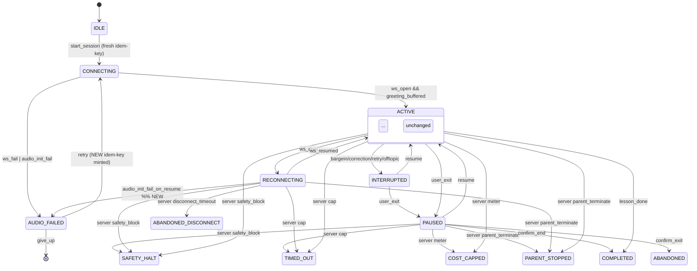

# State Machines Backend Execution Audit
Audit date: 2026-05-11 — backend execution readiness pass

> **2026-05-12 RECONCILIATION NOTE:** All 10 critical issues (C1–C10) flagged in §3 below were RESOLVED in the plan doc `state-machines-mobile-ux.md` on 2026-05-11 (see plan §13 Changelog entries 1–10 under "Backend audit pass"). The §1 Overall Review Summary and §3 Critical Issues sections of this audit doc retain the original audit-time prose for traceability; the per-row **Status** column in §3 records resolution date + plan-doc reference for each item. Net result: the plan is READY FOR IMPLEMENTATION on the backend slice (matching §10 Final Verdict). No outstanding work in this audit.

## 1. OVERALL REVIEW SUMMARY

**Scores (1–10):**
- State Machine Quality: **8** — terminal-state hygiene strong; transitions named; composite states justified.
- Backend Readiness: **6** — DB sketches in §8 are too compact; column types, indexes, constraints under-specified for direct migration.
- AI Readability: **8** — section structure clean, but cross-references between §4/§5/§7/§8 require synthesis; some endpoints declared without HTTP method+code matrix.
- Concurrency Safety: **7** — CAS pattern + unique partial index correct; idempotency-key storage, lockout race, and audit-table backpressure under-specified.

**Strengths:** Principle 4 (DB-FK COPPA) is correct and uncircumventable; §5 forbidden-transition matrix exhaustive; pre-mortem (§11) names the three highest-risk failure modes (ENUM drift, key collision, audit backpressure) and proposes targeted mitigations; ADR-002 correctly kills dual-authority on `RECONNECTING → ABANDONED_DISCONNECT`.

**Weaknesses:** ENUM column types never declared in DDL form — `state ENUM` is shorthand, not SQL; idempotency-key storage table missing (where does the server keep `(key, response_hash, created_at)`?); rate limiter referenced for `parent/auth` without store/window; `realtime-orchestrator` event-emit ordering vs DB commit not specified (event-before-commit = phantom terminal).

**Critical risks:** (1) idempotency without a persistence schema — race window between `INSERT … ON CONFLICT` and response-cache lookup is undefined; (2) `parent_stop_cooldown_until` column added in §5 row 5 is not declared in §8.4 DDL; (3) CAS column name inconsistent — §7 row 3 uses `session_state`, §8.2 uses `state` + `state_version`, §5 last row uses `session_state_version` — three names, one column.

## 2. VERIFIED STATE MACHINES

| Entity | Verdict | Evaluation |
|---|---|---|
| **Onboarding** | **VALID** | §2.1 / §3.1 / §4.1 internally consistent. COPPA gate correctly precedes child profile. Only gap: client-side machine, so backend only owns COPPA + profile + auth — fine. |
| **LessonSession** | **PARTIALLY VALID** | §2.2 composite ACTIVE is sound; 6 terminal `end_reason` enumerated; but `AUDIO_FAILED → CONNECTING` retry edge (§2.2 line 126) bypasses the idempotency-key rule (§4.2 row 1) because the same CTA-minted key would replay across retries — server returns the failed prior session, not a new one. Needs a key-refresh rule on retry. |
| **DevicePairing** | **PARTIALLY VALID** | `PAIRING_FAILED → SCANNING` (§2.3) loses the `pairing_token` issued by `/v1/devices/pairing-token` (§8.3) without revocation — token survives to its 10-min TTL on a parallel device. Plan also lacks a transition for `CLAIMED → NAMED` failure (rename rejected by profanity filter §4.3 row 9). |
| **ParentApproval** | **PARTIALLY VALID** | Authoritative pieces (lockout, audit, TTL) correct. But §2.4 shows `GATE_PROMPT → LOCKED: cancel` without invalidating the in-flight `parent_auth_attempts` row — open audit rows accumulate. Also `COURSE_APPROVAL_PENDING` 5-min expiry (§6 last row) has no state — only a timer comment. |

## 3. CRITICAL ISSUES

| # | Issue | Impact | Why it breaks backend | Fix | Status |
|---|---|---|---|---|---|
| C1 | **CAS column name drift** — `state_version` (§8.2), `session_state` (§7 race-3), `session_state_version` (§5 last row), and `state_version INT` (§8.2 DDL) all refer to the same column. | High | Migrations will be written against the wrong name; CAS predicate becomes a no-op (matches nothing → every terminal succeeds → lost updates). | Pick `state_version INTEGER NOT NULL DEFAULT 0` on `realtime_sessions`. Update §5, §7, §8.2 to one name. Apply pattern to all 4 entities (each terminal-transition table needs it). | **RESOLVED 2026-05-11** — `state_version` is the canonical column name across §5 last row, §7 race-3, §8.2/§8.3/§8.4 DDL. 11 occurrences; zero stale `session_state`/`session_state_version` references. See plan `## 13 Changelog → "Backend audit pass (2026-05-11)" entry 1`. Re-verified 2026-05-12 by P1.1 grep. |
| C2 | **Idempotency storage undefined.** §7 lists keys per endpoint but never names the table that holds `(key, user_id, response_body_hash, created_at, expires_at)`. | High | Without storage, "returns existing row" is a wish. Concurrent retries hit a race between `INSERT … ON CONFLICT (key) DO NOTHING RETURNING` and `SELECT response`. | Declare `idempotency_keys(key TEXT PRIMARY KEY, user_id UUID, endpoint TEXT, response_body BYTEA, status_code SMALLINT, created_at TIMESTAMPTZ, expires_at TIMESTAMPTZ)` with TTL sweep (24h). Use `INSERT … ON CONFLICT DO UPDATE … RETURNING xmax = 0 AS inserted` to detect first writer. | **RESOLVED 2026-05-11** — `idempotency_keys` table declared in plan §7 with full DDL, first-writer detection (`xmax = 0`), 24h TTL sweep, request-body-hash mismatch handling, replay-cache policy. Changelog entry 2. |
| C3 | **`parent_stop_cooldown_until` column missing from DDL.** §5 row 5 introduces it; §8.4 DDL never declares it. | High | Migration won't be written; the 423-Locked guard at `POST /v1/sessions/start` (§5 row 5) has no column to read. | Add `parent_stop_cooldown_until TIMESTAMPTZ NULL` to `users` table (or new `user_session_blocks` table if cooldown needs reasons). Index `WHERE parent_stop_cooldown_until > now()`. | **RESOLVED 2026-05-11** — `users.parent_stop_cooldown_until TIMESTAMPTZ NULL` declared in plan §8.1 DDL (correct location: column lives on `users`, which is §8.1 Onboarding; original audit cited §8.4 in error). Partial index `users_cooldown_idx` added. `coppa_consents.revoked_at` added forward-compat. Changelog entry 3. Re-verified 2026-05-12 by P1.2 grep. |
| C4 | **WS event-emit vs DB commit ordering unspecified.** §8.2 says `realtime-orchestrator` emits `session.end` and persists `end_reason` — order matters. | High | If event fires before commit and the txn rolls back, client sees terminal state, server still has ACTIVE row. Mobile mirrors phantom terminal. | Mandate: outbox pattern (`session_event_outbox` table written in same txn as state update; relay process pushes to WS). Or: WS emit only inside `AFTER COMMIT` hook. Spec which one in §8.2. | **RESOLVED 2026-05-11** — Outbox pattern + `session_event_outbox` table + `realtime-outbox-relay` documented in plan §8.2. Inline AFTER-COMMIT also acceptable. Emit-before-commit explicitly forbidden. Changelog entry 4. |
| C5 | **`AUDIO_FAILED → CONNECTING` retry replays stale Idempotency-Key.** §2.2 line 126 + §4.2 row 1 + §7 idempotency table. | Medium | Server returns the failed prior `realtime_sessions` row (or 409); user sees retry button do nothing. | New rule: on `AUDIO_FAILED → CONNECTING`, client mints a fresh Idempotency-Key. Document in §4.2 row 1 footnote. Server enforces: a session in non-OPEN state served from idempotency cache returns 410 Gone, not 200. | **RESOLVED 2026-05-11** — Plan §4.2 IDLE→CONNECTING row updated: client mints fresh key on retry; server returns 410 Gone + `Retry-With-New-Key=true` for stale-key replay. New §4.2 rows for `AUDIO_FAILED → CONNECTING` and `AUDIO_FAILED → ABANDONED`. Changelog entry 5. |
| C6 | **`parent_auth_attempts` insert before rate-limit check.** Pre-mortem scenario C (§11) acknowledges it, but §4.4 row 2 and §8.4 still don't move the limiter ahead of the insert. | High | Brute-force fills the audit table before lockout fires — Postgres disk fill (live risk per scenario C). | Order: (1) Redis token-bucket rate limit per `(user_id, ip)`, 10 req / 5 min; (2) bcrypt compare; (3) outcome insert. Reject at step 1 with 429 without an attempt row. Keep a separate `parent_rate_limit_rejects` counter (sampled, not per-request) for audit. | **RESOLVED 2026-05-11** — Plan §4.4 GATE_PROMPT→AUTHENTICATED row documents the 4-step server order (Redis token-bucket → lockout pre-check → bcrypt → outcome insert). `parent_auth_attempts` written only after steps 1+2 pass. Changelog entry 6. |
| C7 | **`Idempotency-Key` not declared idempotent over 4xx.** §7 row 3 says "Returns existing session if OPEN" but doesn't define replay behavior when the original returned 402/409. | Medium | Retry-on-failure clients (mobile network layer) burn through subscription preconditions. | Spec: cache replays for 2xx and 4xx-business (402/409/410/423); never cache 5xx. Document in §7 idempotency table. | **RESOLVED 2026-05-11** — Cache-replay policy applied during C2 work: 2xx + 4xx-business cached; 5xx never cached; cross-referenced from C5 row. Changelog entry 7. |
| C8 | **`parent_sessions.jti` lookup not indexed for revocation.** §4.2 row 13 mandates `jti` membership check on every `parent_terminate` event. | Medium | At scale (many parents, long-lived sessions) the lookup becomes a seq scan during a hot kill path. | `parent_sessions(jti UUID PRIMARY KEY)` already in §8.4 — confirm PK. Add `INDEX (user_id) WHERE expires_at > now()` for the "active rows" predicate. | **RESOLVED 2026-05-11** — Plan §8.4 adds `parent_sessions_active_by_user_idx (user_id) WHERE expires_at > now()` partial index. Changelog entry 8. |
| C9 | **Onboarding ABANDONED resumption rule contradicts §3.1.** §3.1 row `ABANDONED` says "Resumable on next launch unless consent was the cause." §4.1 has no transition out of ABANDONED. | Low | Mobile can resume; backend has no defined behavior — does it carry the prior `pairing_attempts` / consent decline forward? | Add §4.1 row `ABANDONED → SPLASH (app_relaunch)` with note: consent-decline branch must restart from `COPPA_CONSENT`, not from cursor. Pure mobile-side concern, but declare it. | **RESOLVED 2026-05-11** — New §4.1 row: `app_relaunch` restores from `onboarding.cursor` unless prior ABANDONED reason was `consent_declined` (cursor discarded; flow restarts at COPPA_CONSENT). Changelog entry 9. |
| C10 | **`COURSE_APPROVAL_PENDING` 5-min server expiry has no scheduler.** §6 last row + §8.4 `parent_approvals.state` ENUM. | Medium | An approval row stuck PENDING forever blocks the child UX path. | Add `parent_approvals.expires_at TIMESTAMPTZ NOT NULL DEFAULT now() + interval '5 minutes'`. Sweeper job (`pg_cron` or service worker) transitions `state='PENDING' AND expires_at < now()` to `EXPIRED`. Client UI treats EXPIRED identically to `cancel`. | **RESOLVED 2026-05-11** — Plan §8.4 declares `parent_approvals.expires_at TIMESTAMPTZ NOT NULL DEFAULT now() + interval '5 minutes'` + partial index + `pg_cron` 1-min sweeper. New §4.4 row `server_expired` transitions PENDING→EXPIRED. Changelog entry 10. |

## 4. TRANSITION AUDIT

**Valid (sound, backend-enforceable):** Onboarding §4.1 all rows; LessonSession §4.2 rows 2,3,4,5,6,8,9,11,12,14; DevicePairing §4.3 rows 1,2,3,5,6,7,8; ParentApproval §4.4 rows 2,3,4,5,7,9.

**Invalid / problematic:**
- §4.2 row 1 (`IDLE → CONNECTING`) — see C5. Fix: refresh key on retry; server returns 410 on cached-failed-session replay.
- §4.2 row 13 (`ACTIVE → PARENT_STOPPED`) — JWT `jti`-vs-`parent_sessions` check correct, but no transaction boundary; needs to be CAS-wrapped with `WHERE state='ACTIVE' AND state_version=N` (same as other terminal rows).
- §4.3 row 9 (`NAMED → FIRST_LESSON_READY` profanity check) — no error transition. Fix: add `NAMED → NAMED (rename_rejected, validation_error)` self-loop with 422 response from `PATCH /v1/devices/{id}`.
- §4.4 row 1 (`LOCKED → GATE_PROMPT`) — no API. Should call nothing, but §4.4 row 2 inserts on every submit; preflight `GET /v1/parent/lockout-status` would cut down on insert volume. Recommended, not required.

**Missing transitions:**
- LessonSession: `RECONNECTING → AUDIO_FAILED` (audio pipeline can fail during resume). Add edge with 409 from `session.resume`.
- LessonSession: `PAUSED → SAFETY_HALT` is implicit but unstated — safety filter runs on server side and can fire while client is in PAUSED. Backend MUST be allowed to terminate from any non-terminal state.
- DevicePairing: `CLAIM_PENDING → OFFLINE` (phone loses network while polling). Currently no edge; the state machine traps in `CLAIM_PENDING` until 60s timeout.
- ParentApproval: `GATE_LOCKED_OUT → GATE_LOCKED_OUT (attempt_during_lockout)` — server should still 423 (not 401); client should NOT increment counter. Document explicitly.

## 5. EDGE CASE ANALYSIS

**Missing failure / timeout coverage:**
1. **Server-side WS half-open detection.** §8.2 mentions "15s server PING, 5s pong, 3 misses → terminate" but doesn't say what state the session sits in during the 30s detection window. Mobile may be in ACTIVE, server already moving to terminal. Spec: server sets `state='RECONNECTING'` after first miss, NOT after declaring dead.
2. **`POST /v1/sessions/{id}/end` failure mid-flight.** Client sends user_exit; network drop before response. Idempotency-Key on path `id` per §7 row 4 — but `id` is the session-id, not a per-request key; the next legitimate end attempt collides. Spec: server makes `end` idempotent on `(id, end_reason)` and returns the persisted reason regardless.
3. **Cost-cap firing during PAUSED.** §2.2 only allows `ACTIVE → COST_CAPPED`; if server detects accumulated cost > 0.12 during pause, it cannot transition. Spec: allow terminal events from PAUSED + RECONNECTING.
4. **DevicePairing — `device_serial` collision.** Two users claim the same robot serial within the 10-min `pairing_token` TTL. §7 says "second claim returns 409" — but the unique key on `devices(serial)` is not declared in §8.3 DDL.
5. **`SESSION_EXPIRED` while `COURSE_APPROVAL_PENDING`.** Composite expiry: parent session expired while approval pending. §2.4 doesn't show the transition. Server should auto-cancel pending approvals when parent session expires (`parent_approvals.state='CANCELED_BY_PARENT_EXPIRY'`).

**Partial-failure compensation:**
- §6 covers DevicePairing stale-unclaim (24h sweep) — good.
- §6 says LessonSession is append-only — but cost misbilling is "outside the state machine"; refund path is a side-channel. Acceptable, but flag in §13.
- COPPA revocation: §6 explicitly outside scope — acceptable, but `coppa_consents.revoked_at` column should exist (NULLABLE) for forward-compat. Currently §8.1 has no revocation column.

**Distributed-transaction concerns:**
- Cross-service: `parent.terminate → session.end`. parent-auth-svc emits; realtime-orchestrator consumes. If consumer crashes, parent thinks child stopped; child still playing. Need outbox + at-least-once + idempotent consumer (C4 fix covers this).
- `coppa.consent.recorded → profile.create` — same outbox pattern needed if coppa-svc and profile-svc are separate.

## 6. CONCURRENCY & SAFETY REVIEW

**Race conditions + fixes:**
1. **Double-tap "Start Lesson"** — `POST /v1/sessions/start` needs **`Idempotency-Key` header (required, 422 if absent)** PLUS unique partial index: `CREATE UNIQUE INDEX realtime_sessions_active_idx ON realtime_sessions (user_id, device_id) WHERE state IN ('CONNECTING','ACTIVE','RECONNECTING','PAUSED')`. Both required: header guards retries, index guards two-tab/two-device.
2. **Concurrent terminate** — `UPDATE realtime_sessions SET state=$1, end_reason=$2, state_version=state_version+1 WHERE id=$3 AND state IN ('CONNECTING','ACTIVE','RECONNECTING','PAUSED','INTERRUPTED') AND state_version=$4 RETURNING state`. If 0 rows, return 409 with current `state` in body.
3. **PIN lockout race** — `UPDATE parent_lockouts SET attempt_count=attempt_count+1, last_attempt_at=now() WHERE user_id=$1 RETURNING attempt_count, locked_until`. With row lock via `SELECT … FOR UPDATE` inside transaction. Five-attempt fire is a transactional rule, not a check-then-set.
4. **Device claim collision** — `POST /v1/devices/claim` needs **unique constraint `devices(serial)` UNIQUE** + idempotency on `pairing_token`. Currently §8.3 has neither declared at column level.
5. **Audit table backpressure (scenario C)** — see C6. Redis bucket BEFORE insert.

**Endpoints + guards (named):**
| Endpoint | Guard | HTTP code |
|---|---|---|
| `POST /v1/sessions/start` | `Idempotency-Key` header required; unique partial index on active states; cooldown check `users.parent_stop_cooldown_until <= now()` | 422 (no key), 409 (active exists), 423 (cooldown) |
| `POST /v1/sessions/{id}/end` | CAS on `(id, state, state_version)`; idempotent on `(id, end_reason)` | 409 on stale version, 200 on replay |
| `WS /v1/session/{id}` upgrade | `device_session_id` not currently bound to a live socket; row state IN (CONNECTING, ACTIVE, RECONNECTING) | 409 on double-attach |
| `POST /v1/devices/claim` | `pairing_token` JWT valid + unconsumed; `devices.serial` UNIQUE | 409 on serial collision, 410 on consumed token |
| `POST /v1/parent/auth` | Rate-limit BEFORE insert; lockout-row pre-check | 429 (rate), 423 (lockout), 401 (wrong) |
| `POST /v1/coppa/consent` | Unique `(user_id, consent_version)` | 409 returns existing row |
| `POST /v1/profiles/child` | FK `children.coppa_consent_id` to `coppa_consents` | 422 if no consent row |
| `POST /v1/parent/approvals/{id}/decide` | CAS on `state='PENDING'`; expiry check | 409 if decided, 410 if expired |

**Idempotency table:** see C2 fix.

## 7. BACKEND MAPPING REVIEW

**Onboarding (§8.1):** DDL adequate for `coppa_consents` and `children`; missing `coppa_consents.revoked_at TIMESTAMPTZ NULL` for forward-compat; missing `idempotency_keys` table (C2). Endpoint set fine. Service responsibility clean — `profile-svc` owns child writes, `coppa-svc` owns consent writes.

**LessonSession (§8.2):** DDL most under-specified. Need:
- `state realtime_session_state NOT NULL` where `realtime_session_state` is a Postgres ENUM type declared in migration. Values: `('CONNECTING','ACTIVE','INTERRUPTED','PAUSED','RECONNECTING','SAFETY_HALT','TIMED_OUT','COST_CAPPED','PARENT_STOPPED','COMPLETED','ABANDONED','ABANDONED_DISCONNECT','AUDIO_FAILED')`.
- `end_reason realtime_session_end_reason NULL` ENUM: `('complete','timeout','cost_limit','barge_limit','parent_stop','user_exit','disconnect_timeout','safety_halt')`.
- `state_version INTEGER NOT NULL DEFAULT 0`.
- `start_at TIMESTAMPTZ NOT NULL DEFAULT now()`, `end_at TIMESTAMPTZ NULL`.
- `cost_cents INTEGER NOT NULL DEFAULT 0` (cents not USD-float).
- Unique partial index per §6 row 1 above.
- `INDEX (user_id, start_at DESC)` for parent dashboard queries.

Service responsibility: `realtime-orchestrator` owns ALL state writes. `safety-svc` emits an event; orchestrator consumes and writes. `metering-svc` emits cost ticks; orchestrator decides cap. NO direct writes from safety-svc or metering-svc to `realtime_sessions`. Document this in §8.2.

**DevicePairing (§8.3):** Needs:
- `devices.serial TEXT NOT NULL UNIQUE`.
- `pairing_attempts.state pairing_state NOT NULL` ENUM.
- `pairing_attempts.token TEXT NOT NULL UNIQUE` for idempotency-on-token.
- `pairing_attempts.expires_at TIMESTAMPTZ NOT NULL`.
- Index on `pairing_attempts (user_id, created_at DESC)` for retry-history queries.

**ParentApproval (§8.4):** Most issues:
- `parent_pins.bcrypt_hash TEXT NOT NULL`; `parent_pins.failed_since TIMESTAMPTZ NULL` for sliding-window resets.
- `parent_lockouts.locked_until TIMESTAMPTZ NULL`, `attempt_count SMALLINT NOT NULL DEFAULT 0`, `last_attempt_at TIMESTAMPTZ NULL`. Need an `INDEX (locked_until) WHERE locked_until > now()` for sweeper.
- `parent_sessions.idle_until TIMESTAMPTZ NOT NULL` (already mentioned) — but §4.4 row 6 says it's checked on every privileged call; need a per-request middleware that does `UPDATE … SET idle_until = now() + interval '5 minutes' WHERE jti = $1 AND idle_until > now() RETURNING jti` — if 0 rows, 401. Make this explicit in §4.4.
- `parent_approvals.expires_at TIMESTAMPTZ NOT NULL` (C10).
- `parent_approvals.state parent_approval_state NOT NULL` ENUM `('PENDING','APPROVED','DENIED','EXPIRED','CANCELED_BY_PARENT_EXPIRY')`.
- Missing: `users.parent_stop_cooldown_until` (C3).

## 8. IMPROVED STATE MACHINE DESIGN

Only LessonSession needs a diagram correction — to add (a) RECONNECTING → AUDIO_FAILED, (b) PAUSED → SAFETY_HALT / TIMED_OUT / COST_CAPPED / PARENT_STOPPED, and (c) AUDIO_FAILED key-refresh annotation. Diff:



DevicePairing minor diff — add `NAMED → NAMED (rename_rejected)` self-loop with validation error.

```mermaid
NAMED --> NAMED: rename_rejected (422 from PATCH /v1/devices/{id})
NAMED --> FIRST_LESSON_READY: rename_accepted
CLAIM_PENDING --> OFFLINE: phone_lost_network
```

ParentApproval — add `COURSE_APPROVAL_PENDING → EXPIRED_APPROVAL` driven by server expiry:

```mermaid
COURSE_APPROVAL_PENDING --> VIEWING_DASHBOARD: confirm | cancel
COURSE_APPROVAL_PENDING --> VIEWING_DASHBOARD: server_expired (5min)
```

(No new client state needed — UI shows "request expired" toast; row is server-side EXPIRED.)

## 9. AI EXECUTION READINESS REPORT

| Capability | Ready? | Ambiguity / Fix |
|---|---|---|
| (a) Implement backend services | **NO — minor fixes** | CAS column name drift (C1) and event-ordering (C4) must be resolved before a code-gen agent can write `realtime-orchestrator`. Once §7/§8.2 use one column name and §8.2 names "outbox" or "after-commit", an agent can scaffold the service. |
| (b) Generate API contracts (OpenAPI) | **YES with caveat** | Endpoint list in §8 is sufficient; HTTP status codes in §5/§6/this audit cover error shape. Caveat: `Idempotency-Key` header requirement on `POST /v1/sessions/start` (§7) is mentioned but not declared in the endpoint spec line. Move it into §8.2 explicit header list. |
| (c) Generate DB schema migrations | **NO — needs DDL detail** | §8 uses shorthand (`state ENUM`, `state_version INT`) — not valid SQL. An agent will hallucinate ENUM names and column types. Fix: spell out each `CREATE TYPE … AS ENUM (...)`, each `CREATE TABLE` with column types, each `CREATE INDEX`. My §7 above lists the columns; codify them in §8. |
| (d) Implement state-transition validation | **YES** | §5 forbidden table + §4 transition table give a complete decision matrix. CAS predicate above is mechanical. Agent can produce `assertTransition(from, to, version)` and `applyTransition()` helpers directly. |

Net: BEFORE shipping the backend, resolve C1, C2, C3, C4 — these are the four ambiguities a code-generating agent cannot guess past. C5–C10 are corrections that block correctness but not generation.

## 10. FINAL VERDICT

**READY WITH MINOR FIXES.**

The state model is sound, the principles are right, and the pre-mortem already identified two of the three highest-risk concurrency failures. The fixes needed are mechanical: name one CAS column, declare the idempotency-key table, declare the cooldown column, and mandate outbox-or-after-commit for the orchestrator. None of these require redesign. With those four resolved (C1–C4) and the DDL spelled out in §8, this is implementable end-to-end by Claude / Cursor against the existing service boundaries.

