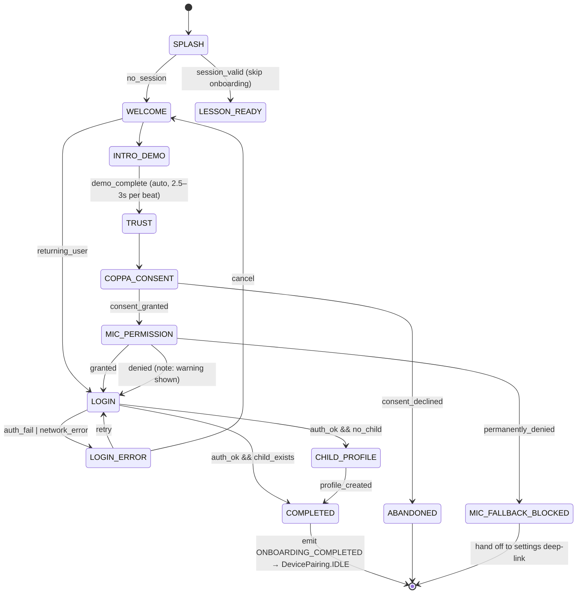
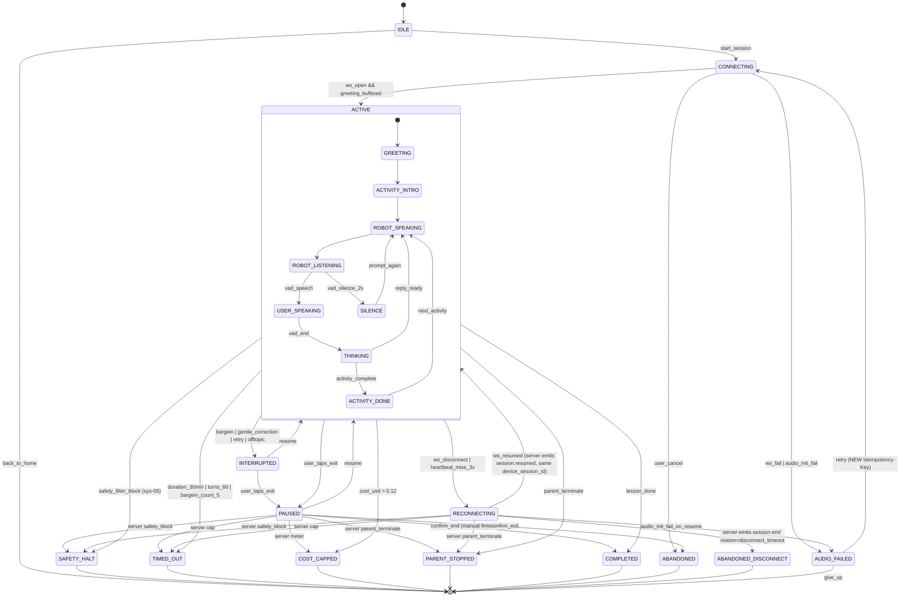
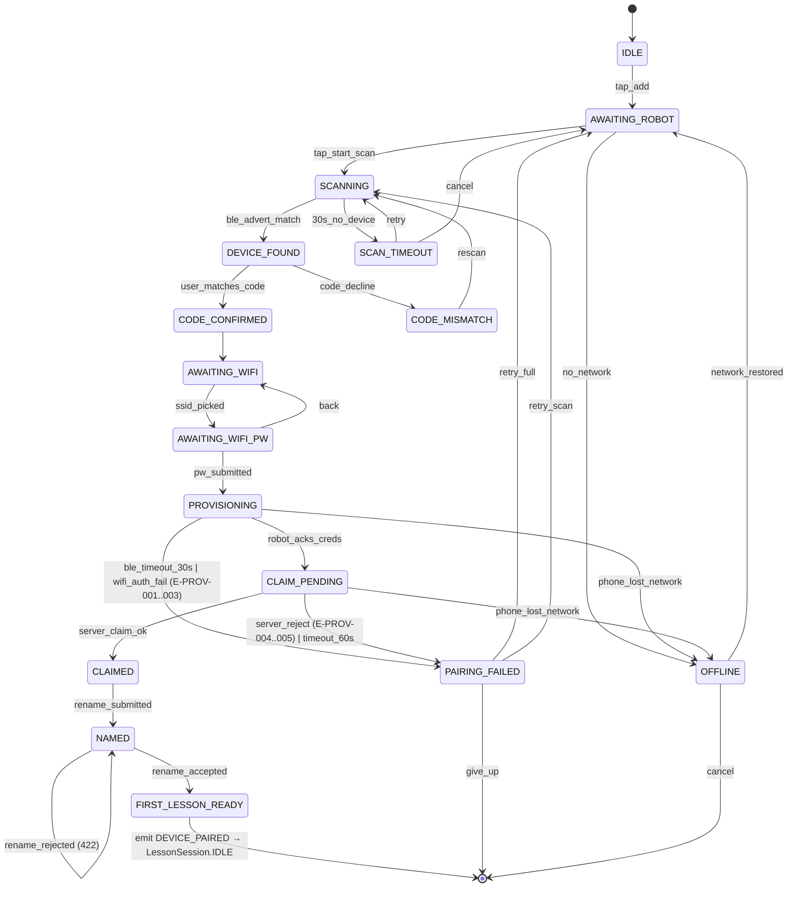
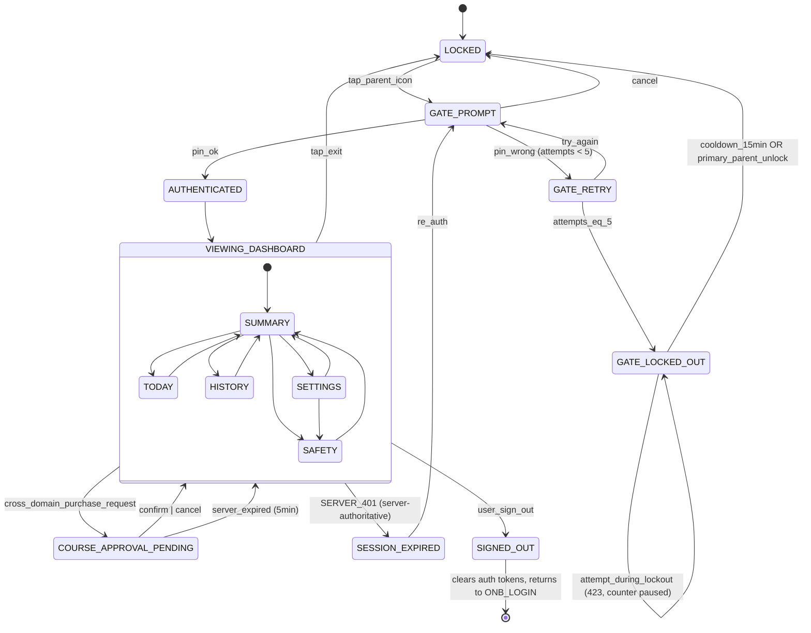
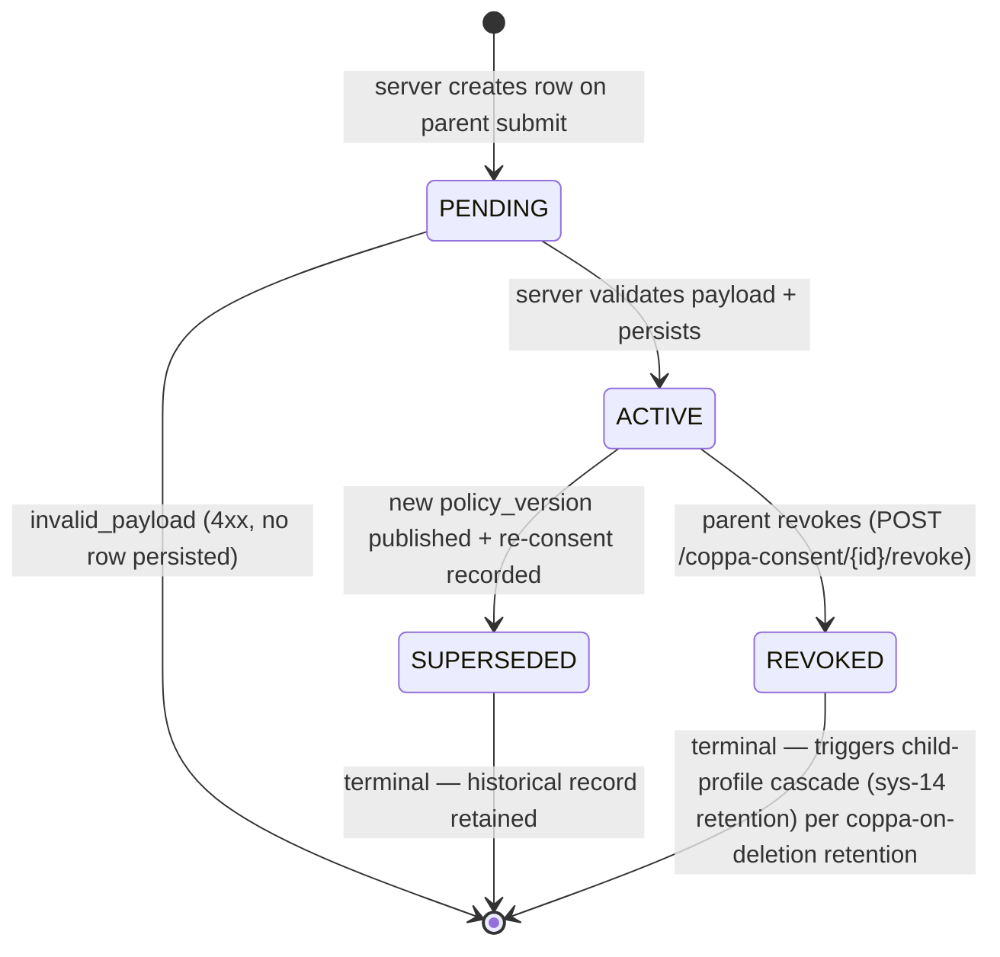
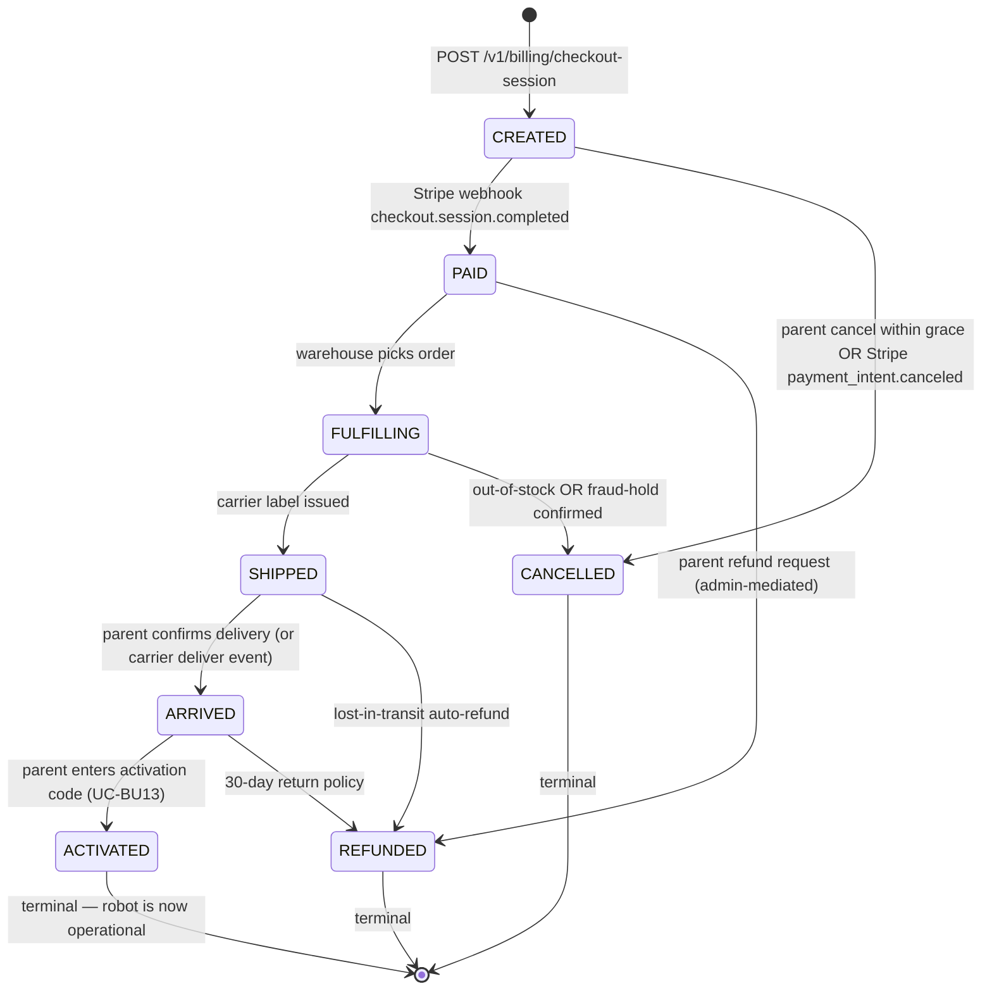
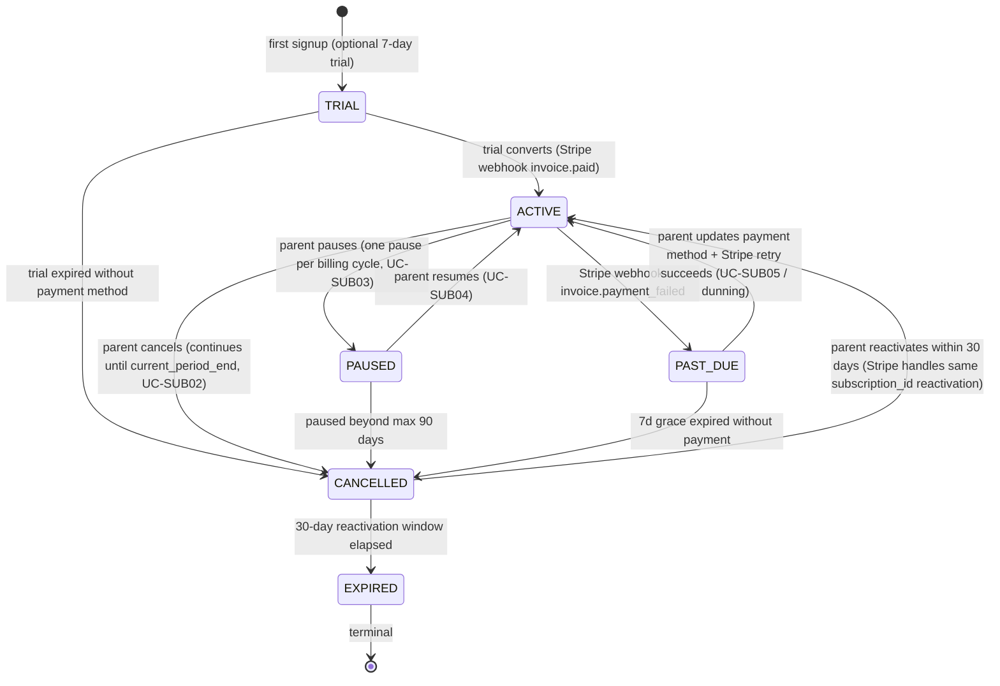
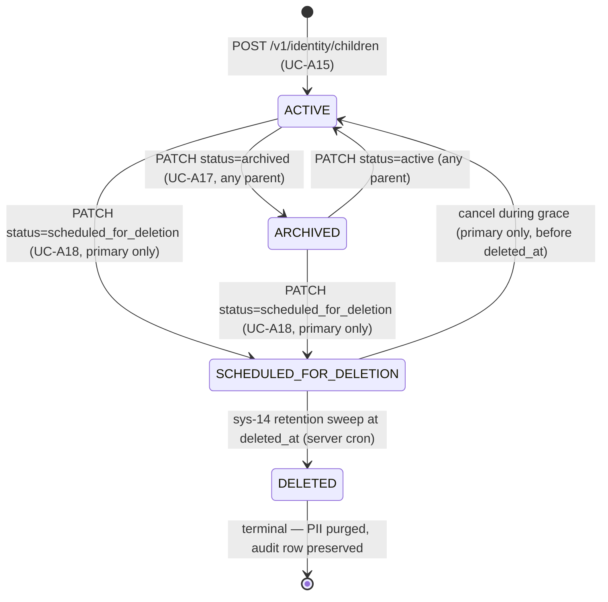

# Mobile UX State Machines — Implementation-Ready Design

**Scope:** 4 entities — Onboarding, LessonSession, DevicePairing, ParentApproval
**Source of truth:** `nav-graph-data.json` (120 states), `docs/flows/domains/*/flow.md`, sys-04 / sys-16 / sys-18 contracts
**Status:** Design proposal, not yet implemented. Closes 10 gaps identified in nav-graph audit (2026-05-11).
**Review status:** Architect + Critic consensus pass (RALPLAN-DR deliberate mode) completed 2026-05-11. Revisions merged below.

---

## 0. Principles

These five principles drive every choice in §§1–10. Violations are called out in the changelog.

1. **Server-authoritative state.** Terminal transitions are emitted by the owning service, never by client wallclock. Client mirrors state for UX; it does not invent terminals. Applies to LessonSession (sys-04), DevicePairing claim (sys-18 server), ParentApproval session (parent-auth-svc).
2. **Explicit terminal states over boolean flags.** Each terminal exit gets its own named state with a distinct `end_reason`. Forbids implicit terminals like `is_done=true` or `error_message != null`.
3. **Idempotency by default on writes.** Every state-advancing POST takes an idempotency key tied to the user-intent moment (CTA tap), not to a transient UI state.
4. **DB constraint as last line of defense.** Where compliance or data integrity is on the line, enforce at schema level (FK NOT NULL, unique partial indexes). Service-layer validation alone is insufficient because client bugs and skipped middleware can bypass it.
5. **Optimistic concurrency via `state_version`.** Terminal transitions use compare-and-swap (`WHERE state = expected AND state_version = N`). First write wins. No lock contention; no lost updates.

**Known partial holds:** Principle 4 is enforced at DB level for COPPA only (`children.coppa_consent_id NOT NULL`). Parent lockout and realtime session uniqueness ride service-layer checks plus unique partial indexes — strong, but not FK-class. See ADR-003.

## 0.1 Alternatives Considered

| Dimension | Option | Pros | Cons | Rejected because |
|---|---|---|---|---|
| **State machine impl (mobile)** | XState (chosen) | Mature, hierarchical/composite support, visualizer, type generation | Bundle size ~30 kB gzipped; learning curve | — |
| | Raw discriminated-union FSM | Zero deps; smallest bundle | Composite states (LessonSession.ACTIVE) require hand-rolled nesting; error-prone | Composite/parallel states are first-class needs (§2.2) |
| | Statechart compiled from `packages/shared-data` schema | Single source of truth across mobile + backend ENUMs | Toolchain to build; team has no prior art | Premature optimization; revisit if drift becomes a real incident |
| **State topology** | Per-entity machines (chosen) | Bounded blast radius; entities evolve independently | Cross-entity events (DEVICE_PAIRED → LessonSession.IDLE) need a bus | Cross-entity coupling is rare (4 transitions total); not worth global machine cost |
| | Single global app machine | Centralized routing, easy to visualize | Every state change touches every reducer; testing nightmare | — |
| **Mobile ↔ backend sync** | Server-pushed state events + client mirror (chosen for LessonSession) | True source of truth lives server-side; survives client bugs | WS dependency for state changes; mobile feels "passive" during reconnect | Accepted: 10s reconnect window is the user-visible cost |
| | Client-driven state, server validates on commit | Faster perceived UX during transitions | Race conditions every time client and server disagree; dual-authority bugs | Rejected after Architect flagged dual-authority on RECONNECTING terminal |

## 1. State Machine Overview

| Entity | Purpose | Owner service | Persisted? |
|---|---|---|---|
| **Onboarding** | First-run flow: splash → consent → mic perm → auth → child profile. Resumable across launches. | mobile (state local) + `auth-svc` + `profile-svc` (COPPA audit) | partial (server: child profile + COPPA consent record; client: resume cursor) |
| **LessonSession** | Voice lesson lifecycle from `lesson_ready` → active turn loop → terminal exit (complete / timeout / cost-cap / safety-halt / abandon). | `realtime-orchestrator` (sys-04) + mobile state mirror | server-authoritative; client mirrors |
| **DevicePairing** | BLE provisioning + cloud claim flow: scan → confirm → wifi → provision → claim → name. | mobile (BLE) + `device-svc` claim API (sys-18 wire) | server-authoritative on claim; mobile holds pre-claim state |
| **ParentApproval** | PIN-gated parent mode session with lockout, audit trail (COPPA), per-feature approvals (course unlock). | mobile + `parent-auth-svc` (audit log to `parent_gate_events` table) | server (audit + lockout counter); client (session ttl) |

---

## 2. Detailed State Machines

### 2.1 Onboarding



### 2.2 LessonSession



### 2.3 DevicePairing



### 2.4 ParentApproval



### 2.5 ConsentForm (added P3.A, ADR-0005)

COPPA parental-consent record lifecycle. One record per `(user_id, child_id, policy_version)` triple — **each child requires its own ACTIVE consent row per ADR-0011 D2** (amended P12). Reusing a prior consent for a new child is not permitted. Backed by `coppa_consents` table (`docs/erd/01-identity/coppa_consents.dbml`); the `children.coppa_consent_id` FK gates child creation on an ACTIVE consent.



**States:** `PENDING` (transient, in-flight write), `ACTIVE` (consent granted, currently authoritative for that policy_version), `SUPERSEDED` (replaced by a newer-version consent — historical), `REVOKED` (parent withdrew consent — terminal). State distinguished by `revoked_at IS NULL` + `(user_id, version)` uniqueness + `version` comparison against `current_policy_version`.

**Transitions:** ACTIVE → SUPERSEDED is server-driven when admin publishes a new policy version AND parent re-consents (creating a new ACTIVE row). The prior ACTIVE row is updated to SUPERSEDED in the same transaction.

**Idempotency:** consent submission keyed on `(user_id, version)` UNIQUE — repeated POST returns existing row.

**Cascade on REVOKED:** RetentionService listens for `consent.revoked` event; soft-deletes child profiles linked via `children.coppa_consent_id` FK; enqueues full GDPR/COPPA deletion pipeline (`14-retention/account-deletion-pipeline.sequence.mmd`).

### 2.6 Order (added P3.C)

Hardware + bundle order lifecycle. One row per checkout-completed order. Backed by `orders` table (`docs/erd/19-billing/orders.dbml`). 7-year retention (financial record).



**States:** `CREATED` (Stripe Checkout Session pending), `PAID` (payment received), `FULFILLING` (warehouse picking), `SHIPPED` (in transit), `ARRIVED` (delivered, awaiting activation), `ACTIVATED` (linked to a `devices` row, normal operation), `CANCELLED` (pre-shipment terminal), `REFUNDED` (post-payment terminal).

**Concurrency:** CAS on `state_version` per existing pattern; `realtime-orchestrator`-style sole-writer rule applies — `billing-svc` writes ORDER state; `fulfillment-svc` writes `tracking_number` but transitions through `billing-svc` event listener.

**Idempotency:** CREATED dedup on `X-Request-Id` (24h); PAID idempotent on `stripe_payment_intent_id` UNIQUE; ACTIVATED idempotent on `(order_id, activation_code)`.

**Refund paths:** REFUNDED reachable from PAID / FULFILLING / SHIPPED / ARRIVED. Each requires admin approval; not directly user-initiated. UC-BU16 "Request Refund" creates a `refund_requests` row that transitions the order asynchronously.

**Auto-refund:** SHIPPED → REFUNDED triggered if `carrier_lost_at IS NOT NULL` from sys-15 fulfillment events. CRON sweeper hourly.

### 2.7 Subscription (added P3.C)

Recurring billing lifecycle. One row per (user_id, plan_id) active subscription. Backed by `subscriptions` table (P5 dbml — not yet authored). 7-year retention.



**States:** `TRIAL` (optional 7-day grace), `ACTIVE` (current period paid), `PAST_DUE` (charge failed; in grace), `PAUSED` (parent-initiated pause, ≤ 90 days), `CANCELLED` (cancellation requested or auto-cancelled; reactivation window open), `EXPIRED` (terminal — must repurchase).

**Concurrency:** CAS on `state_version`. `billing-svc` is sole writer.

**Idempotency:** CANCEL idempotent on subscription_id; PAUSE rejects with 409 if already paused or paused this cycle; RESUME idempotent on subscription_id.

**Entitlement coupling:** PAST_DUE retains entitlements (grace); CANCELLED + EXPIRED soft-revoke entitlements (sets `content_entitlements.revoked_at`); reactivation restores entitlements without re-grant (FK lookup by `subscription_id`).

**Dunning:** PAST_DUE handled by `19-billing/dunning-past-due.sequence.mmd` — 3 retry waves (day 1 / day 3 / day 7) with SES + FCM reminders.

**Pause limits:** `PAUSED` carries `paused_at`, `pause_resume_due TIMESTAMPTZ`. Sweep job auto-cancels rows whose `pause_resume_due < now()`.

### 2.8 ChildProfile (added P12, ADR-0011 + ADR-0010)

Multi-child household profile lifecycle. One row per child. Backed by the existing `children` table (`docs/erd/01-identity/children.dbml`) with status enum `child_status = (active, archived, scheduled_for_deletion, deleted)`. The ADR-0011 vocabulary ("active / suspended / deleted") maps to this enum per the ADR's P11 reconciliation note (`docs/decisions/0011-multi-child-management.md`):

- ADR "active" → `status='active'`
- ADR "suspended" → `status='archived'`
- ADR "deleted (terminal)" → `status='deleted'` (via intermediate `scheduled_for_deletion` during 30-day retention)



**States:**
- `ACTIVE` — child appears in selector + kid surface, runs lessons, accumulates progress.
- `ARCHIVED` — hidden from selector + kid surface; data intact; reversible.
- `SCHEDULED_FOR_DELETION` — 30-day grace window. `deleted_at` is set to `now() + 30d`. Child invisible to all surfaces. Cancel returns to `ACTIVE`.
- `DELETED` — terminal. PII purged via sys-14 cascade. `audit_logs` row retained.

**Transitions:**

| From → To | Trigger | Authorization | Idempotency |
|---|---|---|---|
| `[*] → ACTIVE` | UC-A15 (Add Child) | Any household parent; requires fresh COPPA consent | Dedup on `(household_id, nickname)` |
| `ACTIVE → ARCHIVED` | UC-A17 (Suspend) | Any household parent | Idempotent on `(child_id, status='archived')` |
| `ARCHIVED → ACTIVE` | UC-A17 reverse | Any household parent | Idempotent |
| `ACTIVE → SCHEDULED_FOR_DELETION` | UC-A18 (Delete) | **`role='owner'` (primary parent only)** per ADR-0010 D5 + fresh JWT < 60s | Idempotent on `(child_id, status='scheduled_for_deletion')` |
| `ARCHIVED → SCHEDULED_FOR_DELETION` | UC-A18 from archived | **`role='owner'` only** | Same |
| `SCHEDULED_FOR_DELETION → ACTIVE` | Cancel during grace | **`role='owner'` only** | Reversible until `deleted_at` |
| `SCHEDULED_FOR_DELETION → DELETED` | sys-14 retention sweep at `deleted_at` | Server cron (`pg_cron` hourly) | Server-driven |

**Cascade on DELETED:** sys-14 retention pipeline soft-deletes `realtime_sessions.child_id` rows, `progress_*` snapshots, `content_entitlements` per-child rows. `coppa_consents` linked to this child are marked `revoked` per ADR-0011 D2 (each child has its own consent row). Other children's data untouched.

**Concurrency:** CAS on `state_version` (existing column) for all PATCH operations. `identity-svc` is sole writer.

**Subscription decoupling:** Per ADR-0011 D8, household-level subscription continues regardless of child deletion. Other children retain entitlements.

**Edge: last-child deletion.** If household has only 1 child and that child is scheduled for deletion → server emits an informational `last_child_warning` in the response (not blocking). Account itself stays alive; user can add a new child later.

### 2.9 PrimaryTransfer (added P12, ADR-0010)

Server-mediated transfer of the `primary` role between two household parents. 2-step asynchronous flow with 7-day confirmation window per ADR-0010 D7. Backed by a new `primary_transfer_requests` table (P12 ERD follow-up — not yet authored; deferred per scope).

```mermaid
stateDiagram-v2
    [*] --> REQUESTED: primary POST /v1/household/transfer-primary (UC-PR11)
    REQUESTED --> CONFIRMED: target confirms via fresh biometric+PIN (within 7d)
    REQUESTED --> CANCELLED: primary cancels OR target declines
    REQUESTED --> EXPIRED: 7-day window elapses (server cron)
    CONFIRMED --> [*]: roles flipped in same txn; prior primary's parent_sessions revoked
    CANCELLED --> [*]: terminal — no role change
    EXPIRED --> [*]: terminal — no role change
```



**States:**
- `REQUESTED` — primary has initiated; target has been emailed + in-app notified; awaiting target's response.
- `CONFIRMED` — target accepted with fresh biometric+PIN (ADR-0009 freshness gate); roles atomically swapped server-side.
- `CANCELLED` — primary cancels OR target declines. No role change.
- `EXPIRED` — 7 days elapsed without confirmation. No role change.

**Transitions:**

| From → To | Trigger | Authorization | Idempotency |
|---|---|---|---|
| `[*] → REQUESTED` | UC-PR11 initiate | Primary parent only; fresh JWT < 60s; `to_user_id` is existing active secondary in same household | Dedup on `(household_id)` — only one in-flight request per household |
| `REQUESTED → CONFIRMED` | Target POST `/v1/household/transfer-primary/confirm` | Target user_id matches `to_user_id`; fresh biometric+PIN per ADR-0009 | One-shot via `confirmed_at` column |
| `REQUESTED → CANCELLED` | Primary DELETE `/v1/household/transfer-primary/{request_id}` OR target POST `/decline` | Either party can trigger | Idempotent |
| `REQUESTED → EXPIRED` | Server cron (`pg_cron` hourly) when `expires_at < now()` | Server-driven | Server-driven |

**Atomic role flip on CONFIRMED:** server runs in a single transaction: (a) UPDATE `household_members SET role='manager' WHERE user_id = current_primary_user_id`; (b) UPDATE `household_members SET role='owner' WHERE user_id = to_user_id`; (c) DELETE / soft-revoke all `parent_sessions` for the prior primary (forces re-PIN); (d) audit_logs row written with both user_ids. Either both updates land or neither.

**Pre-conditions on REQUESTED:**
- Initiator's role IS `owner`
- Target's role IS `manager` (secondary)
- Target is `status='active'` in `household_members`
- No in-flight REQUESTED row for this household (409 otherwise)

**SES notification on each transition:** REQUESTED triggers an email to target; CONFIRMED + CANCELLED + EXPIRED trigger emails to both parties. Audit log row written for each transition.

**Race condition (target accepts as their `expires_at` ticks):** server checks `expires_at > now()` AT the moment of confirm; if the expiry-sweeper has already flipped the row to EXPIRED, the target sees 410.

**No silent recovery:** an EXPIRED or CANCELLED transfer cannot be re-confirmed. Primary must initiate a fresh REQUESTED.

---

## 3. State Definitions

### 3.1 Onboarding

| State | Meaning | Entry | Exit | Side effects |
|---|---|---|---|---|
| `SPLASH` | App boot router. Reads session token. | app launch | session check resolved | analytics `app_open`; route decision |
| `WELCOME` | Marketing intro screen. | from SPLASH (no session) | user taps next or "sign in" | none |
| `INTRO_DEMO` | 4-beat demo (listen/speak/retry/celebrate); each beat auto-advances on `setTimeout` 2500–3000ms. | from WELCOME | last beat timer fires | accessibility-only TTS preview |
| `TRUST` | Parent-trust copy block. | from INTRO_DEMO or back-loop | tap next | none |
| `COPPA_CONSENT` | **NEW.** COPPA consent screen — required pre-profile-creation. | from TRUST | parent taps "I consent" or declines | `POST /v1/coppa/consent` (audit row) |
| `MIC_PERMISSION` | OS prompt + rationale screen. | from COPPA_CONSENT | OS resolves promise | invokes platform mic-permission API |
| `LOGIN` | Email/OAuth sign-in or sign-up. | from MIC_PERMISSION or WELCOME (returning) | submit | `POST /v1/auth/login` |
| `LOGIN_ERROR` | Bad creds / network / expired token surfaced. | from LOGIN (rejected promise) | retry or cancel | log to client telemetry; no PII in error body |
| `CHILD_PROFILE` | Capture child name + age + buddy. | from LOGIN if `!user.childProfile` | submit | `POST /v1/profiles/child` |
| `COMPLETED` | Terminal happy. Emits `ONBOARDING_COMPLETED` event. | profile created or already exists | event fired | client sets `onboarding.done=true`; routes to `DevicePairing.IDLE` |
| `ABANDONED` | Terminal — user declined consent or killed app pre-completion. Resumable on next launch unless consent was the cause. | from COPPA_CONSENT decline or app-kill recovery | next launch | persist `onboarding.cursor` for resume |
| `MIC_FALLBACK_BLOCKED` | Permanently denied (iOS "Don't allow" twice / Android "never ask again"). | from MIC_PERMISSION | user opens settings | deep-link to OS settings; client polls perm on app resume |

### 3.2 LessonSession

| State | Meaning | Entry | Exit | Side effects |
|---|---|---|---|---|
| `IDLE` | `lesson_ready` screen, robot idle, no WS. | post-onboarding or post-completion | tap start | analytics `lesson_lobby_view` |
| `CONNECTING` | WS handshake + audio init. | `start_session` | `session.started` event | `POST /v1/sessions/start`; opens WS; allocates `device_session_id` |
| `ACTIVE` | Composite turn loop. Server-authoritative. | `session.started` | terminal event or user-exit | per-turn `turn.created` events; metering |
| `INTERRUPTED` | Recoverable mid-turn diversion. State carries a **`reason` discriminator** (`bargein` / `gentle_correction` / `retry` / `offtopic`) preserved in analytics. | `bargein` / `correction` / `retry` / `offtopic` event | `resume` or `pause` | bargein-reason increments `bargein_count`; analytics emits `lesson.interrupted reason=<reason>` |
| `PAUSED` | Exit-confirm sheet; WS still open. | user tap exit | resume or confirm | none |
| `RECONNECTING` | WS dropped; 10s resume window per sys-04. | `ws_disconnect` or 3 missed heartbeats | resumed or 10s elapsed | client retains `device_session_id`; reconnect attempts |
| `SAFETY_HALT` | Terminal — post-filter safety block (sys-05). | `safety_block` event from server | navigate home | log safety event; no retry edge |
| `TIMED_OUT` | Terminal — 30 min, 60 turns, or bargein cap. | server emits `session.end reason=timeout/turns/barge_limit` | navigate home | server closes session; `end_reason` persisted |
| `COST_CAPPED` | Terminal — $0.12 ceiling reached. | server emits `reason=cost_limit` | navigate home | server closes session |
| `PARENT_STOPPED` | Terminal — parent triggered remote stop. | server pushes `session.terminate by=parent` | navigate home | server closes session |
| `COMPLETED` | Terminal — natural lesson end. | server emits `reason=complete` | navigate to summary | server persists outcome; analytics |
| `ABANDONED` | Terminal — user confirmed exit. | from PAUSED confirm-exit | navigate home | server emits `reason=user_exit` |
| `ABANDONED_DISCONNECT` | Terminal — 10s reconnect window expired. | RECONNECTING timeout | navigate home | server closes session as `timeout` |
| `AUDIO_FAILED` | Audio pipeline or WS init failed. | error during CONNECTING | retry or give up | analytics `audio_error_code` |

### 3.3 DevicePairing

| State | Meaning | Entry | Exit | Side effects |
|---|---|---|---|---|
| `IDLE` | "How it works" intro. | onboarding done | tap add | none |
| `AWAITING_ROBOT` | Prompt to power on robot. | from IDLE | tap start scan | none |
| `SCANNING` | BLE active scan, central role. | tap start scan | advert match or timeout | acquires BLE adapter lock |
| `SCAN_TIMEOUT` | No device found in 30s. | scan timer expires | retry or cancel | none |
| `DEVICE_FOUND` | Advert matched; code shown. | matching advert received | user confirms or declines | BLE GATT subscribe (read-only) |
| `CODE_MISMATCH` | User said code didn't match. | decline | rescan | drop GATT subscription |
| `CODE_CONFIRMED` | Code matched; ready for wifi prov. | user confirm | proceed | BLE secure channel established |
| `AWAITING_WIFI` | SSID picker (BLE-advertised list from robot). | from CODE_CONFIRMED | ssid chosen | reads ssid scan from robot via GATT |
| `AWAITING_WIFI_PW` | Password entry. | ssid picked | submit | none |
| `PROVISIONING` | BLE writes wifi creds; robot attempts wifi join. | pw submit | robot acks or fails | GATT write; 30s timeout watchdog |
| `CLAIM_PENDING` | Robot reached cloud; phone polls `device-svc` for claim status. | provisioning ack | server claim or reject | `POST /v1/devices/claim`; 60s timeout |
| `CLAIMED` | Server registered device to account. | claim 200 | proceed to rename | persist `device_id` to account |
| `NAMED` | User renamed device + chose buddy. | rename submit | proceed | `PATCH /v1/devices/{id}` |
| `FIRST_LESSON_READY` | Terminal — emits `DEVICE_PAIRED`. | named | event fired | route to `LessonSession.IDLE` |
| `PAIRING_FAILED` | Recoverable error with `E-PROV-NNN` code. | provisioning/claim failure | retry or give up | telemetry with error code |
| `OFFLINE` | Phone offline pre-claim. | network watcher | network restored | banner UI; suspends BLE writes |

### 3.4 ParentApproval

| State | Meaning | Entry | Exit | Side effects |
|---|---|---|---|---|
| `LOCKED` | Default — child mode. | app start (post-onboarding) | tap parent icon | none |
| `GATE_PROMPT` | PIN entry sheet. | tap parent icon or `re_auth` | submit or cancel | `POST /v1/parent/auth-attempts` (audit) |
| `GATE_RETRY` | Between failed attempts. | wrong PIN, count<5 | next attempt | client increments local counter; server authoritative |
| `GATE_LOCKED_OUT` | 5 failures hit; 15-min cooldown or primary-parent unlock. | attempts==5 | cooldown OR unlock event | `POST /v1/parent/lockout`; push to primary parent |
| `AUTHENTICATED` | Parent session active, 30-min TTL, 5-min idle expiry. | pin_ok | dashboard rendered | issue parent JWT (short TTL) |
| `VIEWING_DASHBOARD` | Composite of summary / today / history / safety / settings. | from AUTHENTICATED | tab change, sign-out, expiry | per-tab analytics |
| `COURSE_APPROVAL_PENDING` | Cross-domain confirm sheet (purchase, lesson resume after safety). | external trigger | confirm/cancel | `POST /v1/parent/approvals` |
| `SESSION_EXPIRED` | TTL or idle expiry; re-auth required. | timer fires | re-auth or exit | clears parent JWT |
| `SIGNED_OUT` | Terminal — full account sign-out. | user taps sign out | tokens cleared | `POST /v1/auth/logout`; route to `Onboarding.LOGIN` |

---

## 4. Transition Rules

### 4.1 Onboarding

| Source → Target | Trigger | Validation | API |
|---|---|---|---|
| SPLASH → WELCOME | `no_session` | `!authStore.token` | — |
| SPLASH → LESSON_READY | `session_valid` | `authStore.token && childProfile.exists` | `GET /v1/me` |
| INTRO_DEMO → TRUST | `auto_timer` | each beat 2.5–3s; last beat completes | — |
| TRUST → COPPA_CONSENT | `tap_next` | — | — |
| COPPA_CONSENT → MIC_PERMISSION | `consent_granted` | `consentRecord.id` returned | `POST /v1/coppa/consent` (idempotent on `(user_id, consent_version)` — versioned consent must NOT collapse across policy revisions) |
| COPPA_CONSENT → ABANDONED | `consent_declined` | — | log decline (no PII) |
| MIC_PERMISSION → LOGIN | `granted` or `denied` | OS callback | — |
| MIC_PERMISSION → MIC_FALLBACK_BLOCKED | `permanently_denied` | iOS undetermined twice or Android `shouldShowRequestPermissionRationale=false` after deny | — |
| LOGIN → CHILD_PROFILE | `auth_ok && !user.childProfile` | server returns user without child | `POST /v1/auth/login` |
| LOGIN → COMPLETED | `auth_ok && user.childProfile` | — | — |
| LOGIN → LOGIN_ERROR | `auth_fail` | server 401/403/5xx, network err | — |
| CHILD_PROFILE → COMPLETED | `profile_created` | `profile.id` returned | `POST /v1/profiles/child` |
| ABANDONED → SPLASH | `app_relaunch` | mobile-only transition; restores from persisted `onboarding.cursor`. **Exception:** if the prior `ABANDONED` was triggered by `consent_declined` from COPPA_CONSENT, the cursor must be discarded and the flow restarts at COPPA_CONSENT (or at WELCOME if user explicitly clears app data). | — |

### 4.2 LessonSession

| Source → Target | Trigger | Validation | API |
|---|---|---|---|
| IDLE → CONNECTING | `start_session` | active subscription OR free tier, mic perm = granted. **Idempotency-Key minted at CTA tap (not at IDLE entry)** so app-resume re-entering IDLE does not reuse a stale key. **On AUDIO_FAILED → CONNECTING retry, client MUST mint a fresh Idempotency-Key** (C5) — reusing the prior key would replay the cached failure response. Server enforces: an idempotency key tied to a session in non-OPEN state (already terminated) returns **410 Gone** with `Retry-With-New-Key=true`, not the cached 2xx. | `POST /v1/sessions/start` |
| CONNECTING → ACTIVE | `ws_open && greeting_buffered` | WS handshake OK; first audio frame received | WS `session.started` |
| CONNECTING → AUDIO_FAILED | `ws_fail or audio_init_fail` | — | — |
| AUDIO_FAILED → CONNECTING | `retry_audio` | **MUST mint new Idempotency-Key** (per row 1 above). Server returns a brand-new session row; the prior failed session remains terminal. | `POST /v1/sessions/start` (new key) |
| AUDIO_FAILED → ABANDONED | `give_up` | terminal exit; no server call | — |
| ACTIVE.* → INTERRUPTED | `bargein/correction/retry/offtopic` | server event | WS turn events |
| INTERRUPTED → ACTIVE | `resume` | — | — |
| ACTIVE → PAUSED | `user_exit_tap` | — | — |
| PAUSED → ACTIVE | `resume` | session still OPEN | — |
| PAUSED → ABANDONED | `confirm_exit` | — | `POST /v1/sessions/{id}/end` (reason=user_exit; idempotent on `(session_id, end_reason)` — repeat returns the persisted reason) |
| PAUSED → SAFETY_HALT \| TIMED_OUT \| COST_CAPPED \| PARENT_STOPPED | server emit (any of the 4 reasons) | **Server-driven terminals are valid from PAUSED.** Safety/metering/cap rules apply even while child is on the exit-confirm sheet. Mobile receives WS `session.end` and exits PAUSED to the matching terminal. | WS `session.end` |
| ACTIVE → RECONNECTING | `ws_disconnect or 3x_heartbeat_miss` | First heartbeat miss → server sets `state='RECONNECTING'`. Third miss → server terminates with `end_reason='disconnect_timeout'`. (Single-source-of-truth: orchestrator owns the transition.) | — |
| RECONNECTING → ACTIVE | `ws_resumed` | resume within 10s using same `device_session_id` — server emits `session.resumed`. Client never self-resumes. | WS reconnect handshake |
| RECONNECTING → AUDIO_FAILED | `audio_init_fail_on_resume` | If WS resumes but audio pipeline fails to re-initialize on the device, machine moves to AUDIO_FAILED (not a server-side terminal; client-detectable). Server may also emit `session.end reason=audio_failed` to mirror; in either case the session ends. | 409 from `session.resume` if server-side; client-detected otherwise |
| RECONNECTING → ABANDONED_DISCONNECT | `server emits session.end reason=disconnect_timeout` | server-authoritative; client wallclock NOT a trigger. Client may show an `OFFLINE` banner (non-terminal) after a 15s safety fallback to cover dead-WS scenarios where no server event reaches the device — banner reverts when WS reopens, never escalates to a terminal on its own. | server closes session |
| RECONNECTING → SAFETY_HALT \| TIMED_OUT \| PARENT_STOPPED | server emit | **Server-driven terminals also valid from RECONNECTING.** Safety filter, time/turn/barge caps, and parent_stop all reach a session in RECONNECTING even before the resume window closes. | WS `session.end` |
| ACTIVE → SAFETY_HALT | `safety_block` | server emit (sys-05) | WS `safety.halt` |
| ACTIVE → TIMED_OUT | `duration_30min OR turns_60 OR barge_5` | server-side enforcement | WS `session.end reason=timeout/turns/barge_limit` |
| ACTIVE → COST_CAPPED | `cost_usd > 0.12` | server meter | WS `session.end reason=cost_limit` |
| ACTIVE → PARENT_STOPPED | `parent_terminate` | parent JWT `jti` MUST match an active row in `parent_sessions` (not merely "any valid parent JWT for this user"); session must not be expired. Prevents stolen long-lived token from killing a child session. CAS-wrapped same as other terminal rows (`WHERE state IN (...active...) AND state_version=N`). | WS `session.end reason=parent_stop` |
| ACTIVE → COMPLETED | `lesson_done` | activity plan fully consumed | WS `session.end reason=complete` |

### 4.3 DevicePairing

| Source → Target | Trigger | Validation | API |
|---|---|---|---|
| AWAITING_ROBOT → SCANNING | `tap_start_scan` | BLE perm granted, adapter ON | — |
| SCANNING → DEVICE_FOUND | `ble_advert_match` | UUID matches TBOT service prefix; RSSI > -85 | — |
| SCANNING → SCAN_TIMEOUT | `30s_no_device` | client timer | — |
| DEVICE_FOUND → CODE_CONFIRMED | `user_confirm_code` | user tap | — |
| AWAITING_WIFI_PW → PROVISIONING | `pw_submitted` | ssid+pw non-empty; pw length ≥ 8 | BLE GATT write to robot |
| PROVISIONING → CLAIM_PENDING | `robot_acks_creds` | GATT notification `prov.ok` within 30s | — |
| PROVISIONING → PAIRING_FAILED | `ble_timeout OR wifi_auth_fail` | timer or error code | telemetry, error codes E-PROV-001/002/003 |
| CLAIM_PENDING → CLAIMED | `server_claim_ok` | server returns 200 with device_id; idempotent on `pairing_token` | `POST /v1/devices/claim` |
| CLAIM_PENDING → PAIRING_FAILED | `server_reject OR timeout_60s` | server 409/403 or timer | E-PROV-004/005 |
| CLAIM_PENDING → OFFLINE | `phone_lost_network` | client `NetInfo` detects offline while polling claim status. Pause polling; resume on network restore (which re-enters CLAIM_PENDING). Server-side: `pairing_token` TTL (10 min) still applies — if offline persists past TTL, next attempt returns 410 Gone and machine moves to PAIRING_FAILED on retry. | — |
| NAMED → NAMED | `rename_rejected` | server validation failure on `PATCH /v1/devices/{id}` (profanity filter, length, charset). Returns 422 with `field: name`. Machine stays in NAMED; UI re-prompts. | 422 from `PATCH /v1/devices/{id}` |
| NAMED → FIRST_LESSON_READY | `rename_accepted` | name 1–32 chars, no profanity | `PATCH /v1/devices/{id}` (200) |

### 4.4 ParentApproval

| Source → Target | Trigger | Validation | API |
|---|---|---|---|
| LOCKED → GATE_PROMPT | `tap_parent_icon` | — | — |
| GATE_PROMPT → AUTHENTICATED | `pin_ok` | **Server auth order (C6)** — `parent-auth-svc` MUST execute these steps in order: (1) **Redis token-bucket rate limiter** keyed by `(user_id, ip_hash)` — 10 attempts per 5 min sliding window; reject with 429 BEFORE any DB write; (2) **lockout pre-check** on `parent_lockouts.locked_until > now()` → 423; (3) **bcrypt PIN compare**; (4) **outcome insert** into `parent_auth_attempts` (single row per outcome). Steps 1+2 reject WITHOUT writing an attempt row — keeps audit volume bounded under brute-force (pre-mortem scenario C). Separate `parent_rate_limit_rejects` counter (sampled, not per-request) handles 429 telemetry. | `POST /v1/parent/auth` |
| GATE_PROMPT → GATE_RETRY | `pin_wrong && attempts<5` | server returns 401 + attempts_remaining (after auth steps 1–4 above) | same |
| GATE_RETRY → GATE_LOCKED_OUT | `attempts==5` | server returns 423 (locked) | same |
| GATE_LOCKED_OUT → GATE_LOCKED_OUT | `attempt_during_lockout` | server returns 423 (locked) **without incrementing `attempt_count`** — a locked account does not accumulate further "wrong" attempts; lockout counter pauses for the cooldown window. Client must NOT increment its mirror counter. | `POST /v1/parent/auth` (rejected at step 2) |
| GATE_LOCKED_OUT → LOCKED | `cooldown_15min OR primary_parent_unlock` | server lockout expiry OR primary-parent action | `POST /v1/parent/lockout/clear` |
| AUTHENTICATED → SESSION_EXPIRED | `idle_5min OR ttl_30min` | **server-authoritative TTL** (`parent_sessions.expires_at` AND `parent_sessions.idle_until`); client may show an idle warning but the terminal transition only fires when server returns 401 on a privileged call. No dual-timer. **Server middleware** on every privileged call: `UPDATE parent_sessions SET idle_until = now() + interval '5 minutes' WHERE jti = $1 AND idle_until > now() AND expires_at > now() RETURNING jti` — if 0 rows affected, return 401. | — |
| SESSION_EXPIRED → GATE_PROMPT | `re_auth` | — | — |
| VIEWING_DASHBOARD → COURSE_APPROVAL_PENDING | `external_purchase_request` | cross-domain event with pending approval id | — |
| COURSE_APPROVAL_PENDING → VIEWING_DASHBOARD | `confirm OR cancel` | server records approval decision; transitions `parent_approvals.state` to APPROVED or DENIED via CAS on `state='PENDING'`. | `POST /v1/parent/approvals/{id}/decide` |
| COURSE_APPROVAL_PENDING → VIEWING_DASHBOARD | `server_expired` (C10) | server `pg_cron` sweeper runs every minute: `UPDATE parent_approvals SET state='EXPIRED' WHERE state='PENDING' AND expires_at < now()`. Mobile receives WS push `approval.expired {id}` and dismisses the sheet with "request expired" toast. Behaves identically to user `cancel` from the UI side. | server-side sweeper; no client API call |
| (any AUTHENTICATED substate) + COURSE_APPROVAL_PENDING → SIGNED_OUT/SESSION_EXPIRED | parent session ends while approval pending | server auto-cancels open approvals: `UPDATE parent_approvals SET state='CANCELED_BY_PARENT_EXPIRY' WHERE user_id=$1 AND state='PENDING'`. Child UX treats CANCELED_BY_PARENT_EXPIRY identically to EXPIRED. | server-side |
| AUTHENTICATED → SIGNED_OUT | `user_sign_out` | invalidates `parent_sessions` row; cascades to auto-cancel as above. | `POST /v1/auth/logout` |

---

## 5. Invalid Transitions (forbidden, must be blocked server-side)

| Forbidden | Why | Block strategy |
|---|---|---|
| `Onboarding.SPLASH → COMPLETED` directly | Skips COPPA + mic perm, violates legal requirement | Client routing guard + server: `COPPA consent row required` constraint on child profile create |
| `Onboarding.COPPA_CONSENT → CHILD_PROFILE` (skipping consent) | Child profile must reference `coppa_consent_id` | DB FK NOT NULL on `children.coppa_consent_id` |
| `LessonSession.IDLE → COMPLETED` | Can't complete a session that never opened | Server: state guard in `realtime-orchestrator` |
| `LessonSession.SAFETY_HALT → ACTIVE` | Safety halts are terminal — re-engagement requires parent approval flow | Server: 410 Gone on `session.resume` after safety halt |
| `LessonSession.PARENT_STOPPED → ACTIVE` | Parent-stop is terminal by parent intent — resuming the same session bypasses the parent | Server: 410 Gone on `session.resume` after parent_stop |
| `LessonSession.(user,device).PARENT_STOPPED → CONNECTING` (new session immediately) | Parent intent "stop this child now" is bypassed if the child can start a fresh session seconds later | Server: parent-stop sets a `parent_stop_cooldown_until` on the user record (30 min OR until parent explicitly clears via `POST /v1/parent/sessions/{user_id}/unblock`). `POST /v1/sessions/start` returns 423 Locked until cooldown clears. |
| `LessonSession.COMPLETED → CONNECTING` | Sessions are append-only; reuse forbidden | Server: 409 Conflict; client must call `POST /sessions/start` for new id |
| `DevicePairing.PROVISIONING → CLAIMED` (skipping CLAIM_PENDING) | Server claim record must exist before pairing terminal | Server: claim API requires fresh `pairing_token` issued by `device-svc` |
| `DevicePairing.IDLE → CLAIMED` | Without scan + provision, no device session | Server-side validation of provisioning attestation token |
| `ParentApproval.LOCKED → AUTHENTICATED` | Cannot bypass PIN gate | Client routing guard + server JWT issuance only via `/parent/auth` |
| `ParentApproval.GATE_LOCKED_OUT → AUTHENTICATED` | Lockout must expire or be cleared first | Server returns 423; client guards UI |
| `ParentApproval.SESSION_EXPIRED → VIEWING_DASHBOARD` (no re-auth) | Stale parent JWT | Server JWT verification on every privileged endpoint |
| Any entity: `TERMINAL → *` (re-enter terminal state) | Terminal states are write-once | Server: optimistic-concurrency check on the canonical `state_version INTEGER NOT NULL DEFAULT 0` column (same name across all 4 entities — `realtime_sessions.state_version`, `pairing_attempts.state_version`, `parent_sessions.state_version`, `parent_approvals.state_version`) |

---

## 6. Edge-Case States

| Entity | Edge | State | Notes |
|---|---|---|---|
| Onboarding | Mic permanently denied | `MIC_FALLBACK_BLOCKED` | Cannot proceed; deep-link to OS settings; on resume re-evaluate. |
| Onboarding | App killed mid-flow | persisted `onboarding.cursor` | Resume from last completed state on next launch. |
| LessonSession | WS drop | `RECONNECTING` (10s window) | Server keeps session OPEN for 10s; same `device_session_id` reconnects. |
| LessonSession | 30-min cap | `TIMED_OUT` | Terminal; explicit screen "lesson timed out". |
| LessonSession | $0.12 cost cap | `COST_CAPPED` | Terminal; child-friendly "robot needs a break" copy. |
| LessonSession | Parent triggers remote stop | `PARENT_STOPPED` | Server pushes terminate event. |
| LessonSession | Audio init fails | `AUDIO_FAILED` | Retry edge once, then give up. |
| DevicePairing | BLE timeout during provisioning | `PAIRING_FAILED` (E-PROV-001) | Retry from scan or give up. |
| DevicePairing | Wifi auth fail | `PAIRING_FAILED` (E-PROV-002) | Allows wifi-creds re-entry. |
| DevicePairing | Server claim rejects (device already paired to other account) | `PAIRING_FAILED` (E-PROV-004) | Show "this robot belongs to another account" copy. |
| DevicePairing | Phone offline during pairing | `OFFLINE` | Soft pause; recovers on network restore. |
| ParentApproval | 5 wrong PINs | `GATE_LOCKED_OUT` | 15-min cooldown + audit event + push to primary parent. |
| ParentApproval | Parent session TTL hit | `SESSION_EXPIRED` | Must re-auth before any write. |
| ParentApproval | Course purchase deeplink | `COURSE_APPROVAL_PENDING` | Server holds approval row pending; expires 5 min if undecided. |

**Compensation / rollback:**

- `DevicePairing.CLAIMED → reverted` if `NAMED` step abandoned for 24h → server scheduled job unclaims device (allows re-pair).
- `LessonSession.COMPLETED → outcome row` is append-only; cannot rollback. Refunds for misbilled cost-capped sessions are handled outside the state machine via `support-svc`.
- `Onboarding.COPPA_CONSENT` cannot be revoked through this state machine — separate "delete my account" flow per sys-16. **Forward-compat:** `coppa_consents.revoked_at TIMESTAMPTZ NULL` exists in §8.1 schema even though no transition writes it yet.
- `ParentApproval` — no programmatic rollback for DENIED or EXPIRED rows; primary-parent unblock or new approval request is the only path forward.
- `ParentApproval.SESSION_EXPIRED while COURSE_APPROVAL_PENDING` → server auto-transitions all open `parent_approvals.state='PENDING' WHERE user_id=$1` to `CANCELED_BY_PARENT_EXPIRY` in the same txn that invalidates the parent session. Child UX treats this state identically to `EXPIRED`.

**Additional edge cases (audit residual):**

- **LessonSession cost-cap during PAUSED.** Server's cost meter continues accumulating from background services even while the user is on the exit-confirm sheet. Once `cost_cents > 12`, `realtime-orchestrator` writes `state='COST_CAPPED', end_reason='cost_limit'` regardless of source state (ACTIVE / PAUSED / RECONNECTING). See §4.2 row "PAUSED → SAFETY_HALT/TIMED_OUT/COST_CAPPED/PARENT_STOPPED".
- **`POST /v1/sessions/{id}/end` mid-flight failure.** Client sends `user_exit`; network drop before response. Server makes `end` idempotent on `(session_id, end_reason)` — the next legitimate end attempt (or any retry) returns the persisted reason with 200, never 409. Different `end_reason` from the same caller within the idempotency window returns 409 with the persisted reason in the body.
- **`device_serial` collision under TTL.** Two users with valid `pairing_token`s race-claim the same physical robot. `UNIQUE(serial)` in §8.3 forces the second claim to 409. The losing `pairing_attempts.state` moves to `PAIRING_FAILED` with `error_code='E-PROV-004'`.
- **Cross-service distributed transactions.** `parent.terminate → session.end` and `coppa.consent.recorded → profile.create` both cross service boundaries. Use the outbox pattern from §8.2 (`session_event_outbox`) generalized: each emitting service writes an outbox row in the same txn, relayed at-least-once to an idempotent consumer.

---

## 7. Concurrency Considerations

### Race conditions

1. **Onboarding double-submit of COPPA consent or child profile.** Two taps could create two consent rows. Mitigation: idempotency key = `userId + screenName` on `POST /v1/coppa/consent`; child profile creation guarded by unique `(userId)` constraint when single-child product, or `(userId, childName)` if multi-child.

2. **LessonSession start race.** App resumed from background could call `POST /v1/sessions/start` twice. Mitigation: client passes idempotency key (`uuid v4` generated at IDLE entry); server enforces single OPEN session per `userId+deviceId`.

3. **LessonSession concurrent terminate signals.** User taps exit AND server emits TIMED_OUT in same 100ms. Mitigation: CAS on `realtime_sessions` using the canonical `state_version` column — `UPDATE realtime_sessions SET state=$1, end_reason=$2, state_version=state_version+1 WHERE id=$3 AND state IN ('CONNECTING','ACTIVE','RECONNECTING','PAUSED','INTERRUPTED') AND state_version=$4 RETURNING state`. If 0 rows affected → return 409 Conflict with current `state` in body. First write wins. Client trusts server's final `end_reason`.

4. **DevicePairing claim collision.** Two phones provisioning same robot at the same time. Mitigation: server issues `pairing_token` JWT scoped to a single GATT session; second phone's claim returns 409 Conflict.

5. **ParentApproval PIN brute force across devices.** Two devices attempting PIN against same account. Mitigation: lockout counter is server-side and account-scoped (not device-scoped); 5 attempts across any device triggers lockout.

### Idempotency requirements

| Endpoint | Key | Behavior on retry |
|---|---|---|
| `POST /v1/coppa/consent` | `(userId, consent_version)` | Returns existing row for that version; new policy version creates new row |
| `POST /v1/profiles/child` | `userId` (or `userId+name` if multi-child) | Returns 409 with existing profile id |
| `POST /v1/sessions/start` | `Idempotency-Key` header (client uuid, **minted at CTA tap**, never at IDLE entry) | Returns existing session if OPEN |
| `POST /v1/sessions/{id}/end` | `id` (path) | Idempotent — repeat returns final `end_reason` |
| `POST /v1/devices/claim` | `pairing_token` | Returns existing device on token replay |
| `POST /v1/parent/auth` | none — must be non-idempotent (rate-limited instead) | Each attempt counts |
| `POST /v1/parent/approvals/{id}/decide` | `id` (path) | First decision wins; subsequent return 409 |

**Idempotency-key replay caching is cached for 2xx and 4xx-business responses (402, 409, 410, 423). 5xx responses are never cached — the next retry must re-execute.** A consumed key for a stale-state target returns `410 Gone` (e.g., session-start key replayed after the original session reached a terminal state).

### Idempotency-key storage (cross-cutting)

All idempotency-key behavior in the table above is backed by a single shared table:

```sql
CREATE TABLE idempotency_keys (
  key                 TEXT        NOT NULL PRIMARY KEY,
  user_id             UUID        NOT NULL REFERENCES users(id),
  endpoint            TEXT        NOT NULL,                -- 'POST /v1/sessions/start'
  request_body_hash   BYTEA       NOT NULL,                -- sha256 of normalized body
  response_status     SMALLINT    NOT NULL,
  response_body       BYTEA       NOT NULL,                -- cached response (JSON bytes)
  created_at          TIMESTAMPTZ NOT NULL DEFAULT now(),
  expires_at          TIMESTAMPTZ NOT NULL DEFAULT now() + interval '24 hours'
);
CREATE INDEX idempotency_keys_expiry_idx ON idempotency_keys (expires_at);
CREATE INDEX idempotency_keys_user_idx   ON idempotency_keys (user_id);
```

**First-writer detection (canonical pattern, all endpoints):**

```sql
INSERT INTO idempotency_keys (key, user_id, endpoint, request_body_hash, response_status, response_body)
VALUES ($1, $2, $3, $4, 0, '\x'::bytea)
ON CONFLICT (key) DO UPDATE SET key = idempotency_keys.key
RETURNING (xmax = 0) AS is_first_writer;
```

- `is_first_writer=true` → service executes the operation, then `UPDATE idempotency_keys SET response_status=$, response_body=$ WHERE key=$`.
- `is_first_writer=false` → service waits up to 5s for the cached response to populate (poll or LISTEN/NOTIFY on `key`), then replays the cached `(response_status, response_body)`. If still empty after 5s, return 409 with `Retry-After: 5` — the first writer is in flight.
- **`request_body_hash` mismatch on same key** → return 422 `idempotency_key_reuse_with_different_body`.

**TTL sweeper:** `pg_cron` job runs hourly: `DELETE FROM idempotency_keys WHERE expires_at < now()`. Volume-cap: alert if row count > 5M.

### Locks / guards

- **BLE adapter lock** (client): only one DevicePairing instance allowed; `SCANNING`/`PROVISIONING` hold exclusive adapter token.
- **Realtime session lock** (server): per `userId+deviceId` row in `realtime_sessions` with unique partial index `WHERE state IN ('CONNECTING','ACTIVE','RECONNECTING','PAUSED')`.
- **Parent lockout** (server): `parent_lockouts(user_id, locked_until, attempt_count)` with row-level lock during increment.

---

## 8. Backend Implementation Mapping

### 8.1 Onboarding

| Concern | Detail |
|---|---|
| DB | `users(id UUID PK, ..., parent_stop_cooldown_until TIMESTAMPTZ NULL)` — `parent_stop_cooldown_until` is the column read by `POST /v1/sessions/start` (§5 row 5) to enforce the post-parent-stop cooldown; partial index `CREATE INDEX users_cooldown_idx ON users(parent_stop_cooldown_until) WHERE parent_stop_cooldown_until > now()`. Set by `parent-auth-svc` on `parent.terminate`; cleared by `POST /v1/parent/sessions/{user_id}/unblock`. <br> `coppa_consents(id, user_id, version, ip, created_at, revoked_at TIMESTAMPTZ NULL, UNIQUE(user_id, version))`. <br> `children(id, user_id, coppa_consent_id NOT NULL, name, age, ...)` — FK to `coppa_consents.id`. |
| API | `POST /v1/coppa/consent`, `POST /v1/auth/login`, `POST /v1/auth/signup`, `POST /v1/profiles/child`, `GET /v1/me` |
| Service | `auth-svc` (existing) + `profile-svc` + `coppa-svc` (audit log) |
| Events emitted | `coppa.consent.recorded`, `child.profile.created`, `onboarding.completed` |

### 8.2 LessonSession

| Concern | Detail |
|---|---|
| DB | **ENUM types (declared in migration):** <br> `CREATE TYPE realtime_session_state AS ENUM ('CONNECTING','ACTIVE','INTERRUPTED','PAUSED','RECONNECTING','SAFETY_HALT','TIMED_OUT','COST_CAPPED','PARENT_STOPPED','COMPLETED','ABANDONED','ABANDONED_DISCONNECT','AUDIO_FAILED');` <br> `CREATE TYPE realtime_session_end_reason AS ENUM ('complete','timeout','cost_limit','barge_limit','parent_stop','user_exit','disconnect_timeout','safety_halt');` <br> **Tables:** <br> `realtime_sessions(id UUID PK, user_id UUID, device_id UUID, child_id UUID, state realtime_session_state NOT NULL, state_version INTEGER NOT NULL DEFAULT 0, start_at TIMESTAMPTZ NOT NULL DEFAULT now(), end_at TIMESTAMPTZ NULL, end_reason realtime_session_end_reason NULL, turns_count INTEGER NOT NULL DEFAULT 0, bargein_count INTEGER NOT NULL DEFAULT 0, cost_cents INTEGER NOT NULL DEFAULT 0, device_session_id UUID NOT NULL)`. <br> Unique partial index: `CREATE UNIQUE INDEX realtime_sessions_active_idx ON realtime_sessions (user_id, device_id) WHERE state IN ('CONNECTING','ACTIVE','RECONNECTING','PAUSED','INTERRUPTED')`. <br> Dashboard index: `CREATE INDEX realtime_sessions_user_recent_idx ON realtime_sessions (user_id, start_at DESC)`. <br> `realtime_turns(id, session_id, idx, role, text, audio_url, safety_action ENUM, created_at)`. <br> `session_event_outbox(id UUID PK DEFAULT gen_random_uuid(), session_id UUID NOT NULL, event_type TEXT NOT NULL, payload JSONB NOT NULL, created_at TIMESTAMPTZ NOT NULL DEFAULT now(), relayed_at TIMESTAMPTZ NULL)` with `INDEX (relayed_at) WHERE relayed_at IS NULL` — outbox for C4 ordering rule below. |
| API | `POST /v1/sessions/start` (requires `Idempotency-Key` header — 422 if missing), `POST /v1/sessions/{id}/end`, `GET /v1/sessions/{id}`, WS `wss://realtime/v1/session/{id}` |
| Service | `realtime-orchestrator` (sys-04) — **sole writer to `realtime_sessions`**. `safety-svc` (sys-05) emits events only; orchestrator consumes and writes. `metering-svc` emits cost ticks; orchestrator decides cap. NO direct writes from safety-svc or metering-svc to `realtime_sessions`. |
| Events emitted | `session.started`, `turn.created`, `safety.halt`, `session.end` (with `end_reason`) |
| **WS event ordering rule (C4)** | **Outbox pattern.** State change + event row are written in the SAME transaction: `BEGIN; UPDATE realtime_sessions ... ; INSERT INTO session_event_outbox (session_id, event_type, payload) VALUES (...); COMMIT;`. A separate relay process (`realtime-outbox-relay`) reads `session_event_outbox WHERE relayed_at IS NULL ORDER BY created_at`, pushes to WS subscribers, then sets `relayed_at = now()`. Alternative: WS emit may be done inline ONLY inside a Postgres `AFTER COMMIT` trigger or in service code AFTER the txn commits (never before). **NEVER emit-before-commit** — a rolled-back txn with an emitted event creates a phantom terminal on mobile while server still holds ACTIVE. |
| Triggers | heartbeat watchdog (15s server PING, 5s pong, 3 misses → first miss sets `state='RECONNECTING'`, third miss terminates with `end_reason='disconnect_timeout'`); cost-cap meter (per-turn check); turn-cap counter; bargein counter; safety filter (per-utterance) |

### 8.3 DevicePairing

| Concern | Detail |
|---|---|
| DB | **ENUM types:** <br> `CREATE TYPE pairing_state AS ENUM ('TOKEN_ISSUED','PROVISIONING','CLAIM_PENDING','CLAIMED','PAIRING_FAILED','EXPIRED');` <br> **Tables:** <br> `devices(id UUID PK, owner_user_id UUID NULL, serial TEXT NOT NULL UNIQUE, fw_version TEXT, claimed_at TIMESTAMPTZ NULL, named_at TIMESTAMPTZ NULL)` — `UNIQUE(serial)` enforces device-claim collision (one robot, one account) per pre-mortem + audit §5. <br> `pairing_attempts(id UUID PK, user_id UUID NOT NULL, device_serial TEXT NOT NULL, token TEXT NOT NULL UNIQUE, state pairing_state NOT NULL, state_version INTEGER NOT NULL DEFAULT 0, error_code TEXT NULL, created_at TIMESTAMPTZ NOT NULL DEFAULT now(), expires_at TIMESTAMPTZ NOT NULL DEFAULT now() + interval '10 minutes')`. <br> Indexes: `CREATE INDEX pairing_attempts_user_recent ON pairing_attempts (user_id, created_at DESC)`; `CREATE INDEX pairing_attempts_expiry ON pairing_attempts (expires_at) WHERE state IN ('TOKEN_ISSUED','PROVISIONING','CLAIM_PENDING')`. <br> `UNIQUE(token)` enables idempotent claim. |
| API | `POST /v1/devices/pairing-token` (creates `pairing_attempts` row, returns JWT with `jti=token`), `POST /v1/devices/claim` (idempotent on `pairing_token`; 409 on `devices.serial` collision; 410 on consumed/expired token), `PATCH /v1/devices/{id}` (rename — 422 on profanity/length validation), `POST /v1/devices/{id}/unclaim` (revert path for stale unclaimed) |
| Service | `device-svc` + scheduled `unclaim-stale` worker (24h sweep on `devices` where `named_at IS NULL AND claimed_at < now() - interval '24 hours'`); `pairing-token-expiry-sweeper` (1-min `pg_cron`: `UPDATE pairing_attempts SET state='EXPIRED' WHERE state IN ('TOKEN_ISSUED','PROVISIONING','CLAIM_PENDING') AND expires_at < now()`) |
| BLE protocol | sys-18 wire — provisioning GATT service UUID + characteristic UUIDs are FW-owned; client uses `@react-native-ble-plx` |
| Events emitted | `device.pairing.started`, `device.pairing.failed` (with `error_code`), `device.claimed`, `device.named`, `device.pairing.expired` |

### 8.4 ParentApproval

| Concern | Detail |
|---|---|
| DB | **ENUM types:** <br> `CREATE TYPE parent_approval_kind AS ENUM ('course_unlock','lesson_resume_after_safety','feature_unlock');` <br> `CREATE TYPE parent_approval_state AS ENUM ('PENDING','APPROVED','DENIED','EXPIRED','CANCELED_BY_PARENT_EXPIRY');` <br> **Tables:** <br> `parent_pins(user_id UUID PK, bcrypt_hash TEXT NOT NULL, failed_since TIMESTAMPTZ NULL, updated_at TIMESTAMPTZ NOT NULL DEFAULT now())` — `failed_since` supports sliding-window counter reset. <br> `parent_auth_attempts(id UUID PK, user_id UUID NOT NULL, success BOOLEAN NOT NULL, ip INET, ua TEXT, created_at TIMESTAMPTZ NOT NULL DEFAULT now())` — written only AFTER rate-limit + lockout-precheck pass (C6). <br> `parent_lockouts(user_id UUID PK, locked_until TIMESTAMPTZ NULL, attempt_count SMALLINT NOT NULL DEFAULT 0, last_attempt_at TIMESTAMPTZ NULL)`; partial index `CREATE INDEX parent_lockouts_active_idx ON parent_lockouts (locked_until) WHERE locked_until > now()` for the sweeper-and-precheck hot path. <br> `parent_sessions(jti UUID PK, user_id UUID NOT NULL, issued_at TIMESTAMPTZ NOT NULL DEFAULT now(), expires_at TIMESTAMPTZ NOT NULL, idle_until TIMESTAMPTZ NOT NULL, state_version INTEGER NOT NULL DEFAULT 0)`; `CREATE INDEX parent_sessions_active_by_user_idx ON parent_sessions (user_id) WHERE expires_at > now()` for C8 active-rows lookup on parent-terminate hot path. <br> `parent_approvals(id UUID PK, user_id UUID NOT NULL, kind parent_approval_kind NOT NULL, payload JSONB NOT NULL, state parent_approval_state NOT NULL DEFAULT 'PENDING', state_version INTEGER NOT NULL DEFAULT 0, created_at TIMESTAMPTZ NOT NULL DEFAULT now(), decided_at TIMESTAMPTZ NULL, expires_at TIMESTAMPTZ NOT NULL DEFAULT now() + interval '5 minutes')`; `CREATE INDEX parent_approvals_expiry_idx ON parent_approvals (expires_at) WHERE state = 'PENDING'` (C10). |
| API | `POST /v1/parent/auth` (rate-limit→lockout-check→bcrypt→outcome per C6; never 5xx from PIN logic), `POST /v1/parent/lockout/clear` (primary-parent action), `POST /v1/parent/approvals` (create pending, 5-min expiry), `POST /v1/parent/approvals/{id}/decide` (409 on stale state, 410 on expired), `POST /v1/parent/sessions/{user_id}/unblock` (clears `users.parent_stop_cooldown_until`), `POST /v1/auth/logout` |
| Service | `parent-auth-svc` (rate limiter + lockout state + audit log; **`parent_auth_attempts` insert ONLY after rate-limit + lockout pre-check pass**), `parent-approval-svc` (with `pg_cron` expiry sweeper at 1-min interval); per-request middleware updates `parent_sessions.idle_until` (see §4.4 SESSION_EXPIRED row) |
| Events emitted | `parent.auth.success`, `parent.auth.failure`, `parent.auth.rate_limited`, `parent.lockout.triggered`, `parent.lockout.cleared`, `parent.approval.decided`, `parent.approval.expired`, `parent.session.expired` |

---

## 9. Validation Rules

| Rule | Where enforced |
|---|---|
| Child profile create blocked unless `coppa_consents` row exists for user | DB FK + service validator |
| Lesson session start blocked unless: active mic perm (client), valid auth, no other active session for `(user, device)` | Client guard + server uniqueness index |
| Lesson session terminal transitions only valid from non-terminal source states | Server state guard (CAS update with state_version) |
| Device claim only valid with unexpired `pairing_token` (TTL 10 min) | Server JWT validation |
| Parent PIN attempts rejected if `parent_lockouts.locked_until > now()` | Service check before bcrypt compare |
| Parent approval decision rejected if `parent_approvals.state != 'PENDING'` or current_user_id != approval.user_id | Service guard |
| Onboarding: COPPA consent decline routes to ABANDONED, never to CHILD_PROFILE | Client + server (no child create endpoint accepts request without consent_id) |

**Preconditions per write endpoint** (summary):

- All authenticated endpoints require unexpired `auth.access_token`.
- Parent endpoints additionally require unexpired `parent.jwt` (issued from `/parent/auth`).
- Realtime endpoints require child profile ownership match.
- Device endpoints require device ownership OR a fresh `pairing_token` for claim.

---

## 10. Simplification Check

### What I deliberately merged

- **Onboarding `INTRO_DEMO`** — the 4 nav-graph beats (`intro_listen`, `intro_speak`, `intro_retry`, `intro_celebrate`) are presentation sub-steps, not stateful. Modeled as one state with internal timer-driven sub-progress. Backend never persists which beat is showing.
- **LessonSession `INTERRUPTED`** — combines `bargein`, `gentle`, `retry`, `offtopic` (4 nav-graph screens) into one logical state. **A `reason` discriminator field is REQUIRED on the state object** (`reason: 'bargein' | 'gentle_correction' | 'retry' | 'offtopic'`) so analytics fidelity matches the prior 4-screen nav-graph. Without the discriminator the merge is a net loss vs the old design.
- **DevicePairing `AWAITING_WIFI` + `AWAITING_WIFI_PW`** — kept separate because back-edges differ; merging would lose the ssid-correction path.

### What I added (necessary, not over-engineering)

- `COPPA_CONSENT` — legal requirement (sys-16); current nav-graph is non-compliant.
- `MIC_FALLBACK_BLOCKED` — distinct from `mic_missing` (post-onboarding); without it the user gets stuck.
- `RECONNECTING`, `TIMED_OUT`, `COST_CAPPED`, `PARENT_STOPPED`, `ABANDONED_DISCONNECT` — sys-04 contract requires all five `end_reason` codes; nav-graph currently only models `user_exit`.
- `SCAN_TIMEOUT`, `CODE_MISMATCH`, `CLAIM_PENDING` — sys-18 BLE provisioning has these states; nav-graph collapses them into `dv_pair_failed` losing actionable error UX.
- `GATE_RETRY`, `GATE_LOCKED_OUT`, `SESSION_EXPIRED`, `COURSE_APPROVAL_PENDING` — COPPA audit + brute-force protection need these.

### What I did NOT add (would be over-engineering)

- Per-turn fine-grained states inside LessonSession.ACTIVE (e.g., separate `BARGEIN_DETECTING` vs `BARGEIN_RESOLVED`) — server-side concern, not part of mobile contract.
- "Optimistic" pre-states (`OPTIMISTIC_CLAIMED` etc.) — server-authoritative model is simpler.
- Retry-counter states for each error type — counters are scalar columns, not states.

---

## Implementation Steps (proposed)

1. **Schema migrations** — add tables/columns from §8 to `tbot-backend` (one migration per entity).
2. **API endpoints** — implement endpoints from §4 + §8, with idempotency middleware (§7).
3. **State guards** — add CAS update helpers per entity (`state_version` column).
4. **Mobile state machines** — implement as XState machines in `tbot-mobile/src/state/` (one per entity); export typed events.
5. **Nav-graph reconciliation** — update `nav-graph-data.json` to match the 4 machines; add the missing edges (10 gaps).
6. **Test matrix** — per entity: happy path + each terminal transition + each invalid transition (server returns 409/410/423 as designed).

## Acceptance Criteria

- [ ] All 4 entities have XState machines with type-safe events, compiled and tested.
- [ ] Server enforces every invalid transition in §5 (verified via API contract tests returning 409/410/423).
- [ ] Idempotency keys honored on all endpoints in §7 (replay returns same response).
- [ ] `nav-graph-data.json` updated to include the 10 missing edges; `node scripts/flows/validate-go-calls.mjs` exits 0.
- [ ] COPPA consent record exists for every `children` row (data check + FK).
- [ ] Lesson session terminal states emit all 6 `end_reason` codes — 5 server-initiated (`complete | timeout | cost_limit | barge_limit | parent_stop`) + 1 client-initiated (`user_exit`). `disconnect_timeout` is internally treated as `timeout`.
- [ ] Parent lockout triggers at attempt 5, sends push to primary parent, persists audit row.
- [ ] Parent-stop sets cooldown; second `POST /v1/sessions/start` within cooldown returns 423.
- [ ] `INTERRUPTED.reason` discriminator preserved end-to-end (mobile → analytics event payload).

## Risks and Mitigations

| Risk | Owner | Trigger | Sequence (mitigation steps) | Detection |
|---|---|---|---|---|
| BLE pairing has FW dependencies (sys-18 wire) not present in `tbot-design` | mobile + firmware | first integration sprint touches PROVISIONING state | (1) firmware stubs sys-18 GATT chars on dev build; (2) mobile uses contract-version-pinned client; (3) integration sprint replaces stub | CI: contract version mismatch fails build |
| COPPA screen copy requires legal sign-off | product + legal | before §6 ships to TestFlight | (1) draft copy 2 weeks ahead; (2) legal review gate on PR; (3) consent_version bump if copy changes | release checklist gate |
| Cost-cap state needs `metering-svc` wired into realtime orchestrator | backend | LessonSession.COST_CAPPED implementation | (1) metering-svc ships first with per-turn cost emit; (2) realtime-orchestrator subscribes; (3) state machine update; (4) load test cap firing | dashboard: `session.end reason=cost_limit` rate per day |
| XState ↔ backend ENUM drift | shared-data owner | any rename in `packages/shared-data` | (1) generate both from single source; (2) CI fails on ENUM diff between mobile build and migration | CI ENUM-diff check |
| Parent-stop cooldown bypassed via second device | backend (parent-auth-svc) | concurrent device sign-in | cooldown is account-scoped (not device-scoped); enforced at `POST /v1/sessions/start` | alert: `session.start` blocked by cooldown count > 0 |

## Verification Steps

### Unit
- XState transition table assertions: for each entity, programmatic `for each (event, state)` check that valid transitions yield expected target and invalid transitions throw / no-op.
- Idempotency key normalization helper unit tested with replay scenarios (same key → same response; different key → distinct row).
- `INTERRUPTED.reason` discriminator test: each of the 4 reasons enters/exits correctly and emits a tagged analytics event.

### Integration
- Backend contract tests for every §5 forbidden transition — assert documented HTTP status (409 / 410 / 423) and machine-readable error code.
- CAS retry test under contention: parallel terminal transitions; first wins, second receives 409 with `current_state` in body.
- COPPA enforcement: integration test inserts `children` row without `coppa_consent_id` → DB rejects (FK violation), not service-layer.
- Parent-stop cooldown: `POST /v1/sessions/start` returns 423 within 30 min of `parent_stop`; returns 200 after cooldown clears OR after `POST /v1/parent/sessions/{user_id}/unblock`.

### E2E
- Maestro flow (when re-enabled — note: `.maestro/` is currently deleted per `git status`): full Onboarding → DevicePairing → LessonSession.COMPLETED chain.
- Manual smoke against `docs/flows/domains/{onboarding,lesson-session,device,parent}/flow.md` happy paths.
- `node scripts/flows/validate-go-calls.mjs` passes after `nav-graph-data.json` is updated.

### Observability
- Dashboards: `session.end` grouped by `reason` (target: <5% timeout, <1% cost_limit, <0.1% parent_stop).
- Alert: `parent.lockout.triggered` rate > 5/min for any single account (brute-force indicator).
- Alert: `device.pairing.failed` E-PROV-NNN distribution deviation week-over-week.
- Trace span: each state transition emits a span with `entity`, `from_state`, `to_state`, `trigger`, `state_version`.

---

## 11. Pre-Mortem (deliberate-mode, 3 failure scenarios)

### Scenario A — XState ↔ backend ENUM drift in production
Mobile build ships with state name `RECONNECTING` while a backend migration renames the column value to `RESUMING`. Mobile state machine ignores `session.end reason=disconnect_timeout` because event handler keys on the old name. Session shows "reconnecting" indefinitely; user force-quits app; analytics shows spike in `abandoned_without_terminal`.

**Mitigation:** Generate state name ENUM from a single source-of-truth file in `packages/shared-data`. CI fails the mobile build if ENUMs diverge from the latest migration. Document the rule in repo README.

**Detection signal:** Spike in sessions ending in client-side `ABANDONED` without a matching server `session.end` row.

### Scenario B — Idempotency key collision on app-resume race
User backgrounds the app at `IDLE`. iOS suspends the JS bundle. User foregrounds, taps "Start Lesson". App restoration re-runs IDLE state entry (regenerating key) AND immediately fires the tap handler (regenerating key again) — two `POST /v1/sessions/start` fire within 80 ms with different keys. Server creates two OPEN sessions for the same `(user, device)`. The unique partial index trips, the second insert rolls back, but the WS for the first session is already orphaned because the client subscribed only to the second.

**Mitigation:** Mint the idempotency key at the CTA tap handler, never at state entry (already in §4.2, §7). Add a `device_session_id` uniqueness guard on the WS upgrade endpoint that rejects a second connect during the first's lifetime.

**Detection signal:** `session.start` returning duplicate-key error in logs; WS connect rejected with "session already attached".

### Scenario C — Parent-lockout audit table grows faster than lockout fires
Adversary brute-forces parent PIN at 100 attempts/sec from a botnet. Lockout counter is account-scoped and fires at attempt 5, but `parent_auth_attempts` is request-scoped and accepts every attempt before the lockout check (or the rate limiter) sees them. Audit table balloons; primary RDS instance disk fills; lockout query slows; service degrades for all parents.

**Mitigation:** Place rate limiter BEFORE auth-attempt insert. Cap `parent_auth_attempts` rows per `(user_id, 1h window)` at the table level via partition pruning. Sentinel: if `account.attempt_count_in_24h > 50`, escalate to account-suspend, not just lockout.

**Detection signal:** `parent_auth_attempts` insert rate > 10× baseline; lockout-clear count rising.

---

## 12. ADRs (Architecture Decision Records)

### ADR-001 — Use XState for mobile state machines

**Decision:** Implement all 4 entities as XState machines (`@xstate/react`).
**Drivers:** Composite states (LessonSession.ACTIVE turn loop), parallel states (DevicePairing.OFFLINE banner across all sub-states), visualizer for design review, type-safe event handling.
**Alternatives considered:** Raw discriminated-union FSM (no composite support); statechart compilation from `packages/shared-data` (no toolchain, premature).
**Why chosen:** Composite/parallel needs are first-class. Bundle cost (~30 kB gzipped) acceptable for a kids' app where bundle is already MB-scale.
**Consequences:** New dependency; team training. Bundle size up. Visualizer enables design reviews.
**Follow-ups:** Decide before Q2 if drift incidents justify compiling from shared-data schema instead.

### ADR-002 — Server-authoritative LessonSession with 10s reconnect window

**Decision:** All LessonSession terminal transitions originate from server emit (`session.end`, `session.resumed`). Client mirrors; never invents.
**Drivers:** Single source of truth eliminates dual-authority bugs. sys-04 already mandates this for billing/safety integrity.
**Alternatives considered:** Hybrid client/server timers (initial proposal). Client-only terminals on WS drop.
**Why chosen:** Architect review found dual-authority on RECONNECTING → ABANDONED_DISCONNECT — client wallclock could fire while server still has session OPEN. Server-only avoids the race.
**Consequences:** UX during dead-WS scenarios feels passive — client shows RECONNECTING indefinitely with an OFFLINE banner after 15s safety fallback (non-terminal). Worst case: user force-quits if connection is truly dead; server times out naturally and bills nothing past the cap.
**Follow-ups:** Monitor support tickets for "stuck in reconnecting" — if >0.5% of sessions, revisit fallback timing.

### ADR-003 — DB FK as primary COPPA enforcement, service-layer secondary

**Decision:** `children.coppa_consent_id` is `NOT NULL` with FK to `coppa_consents`. Service-layer validators check it too, but the DB is the gate.
**Drivers:** Client bugs and skipped middleware bypass service-layer validators. COPPA fines start at $43k/violation. Layered defense.
**Alternatives considered:** Service-layer only ("just enforce in code"). Trigger-based audit only.
**Why chosen:** FK is uncircumventable. If a future migration tries to drop it, the migration review catches it.
**Consequences:** Migration to add the column requires backfill (legacy rows without consent get a synthetic "legacy_consent_v0" record or the row is blocked). Onboarding cannot complete without consent.
**Follow-ups:** Same FK pattern for `parent_lockouts` and `realtime_sessions` (unique partial index already; consider promoting to constraint). Tracked in §0 "known partial holds".

---

## 13. Changelog (consensus pass)

Applied 2026-05-11 after Architect + Critic review.

**Architect must-fixes (8):**
1. §2.2 + §4.2 — RECONNECTING → ABANDONED_DISCONNECT now server-authoritative (was client wallclock); client OFFLINE banner at 15s as non-terminal safety fallback.
2. §5 — added `PARENT_STOPPED → CONNECTING` cooldown row (30 min or parent unblock); added `PARENT_STOPPED → ACTIVE` forbidden row.
3. §4.1 + §7 + §8.1 — COPPA consent idempotency key now `(user_id, consent_version)`; unique constraint added.
4. §4.2 — PARENT_STOPPED validation now requires parent JWT `jti` match active `parent_sessions` row.
5. §4.2 + §7 — `POST /v1/sessions/start` idempotency key minted at CTA tap, not IDLE entry.
6. §4.4 — SESSION_EXPIRED is server-authoritative; dual-timer removed.
7. §3.2 + §10 — `INTERRUPTED.reason` discriminator made REQUIRED.
8. §0.1 — table of alternatives added (covers framework + topology + sync-direction tradeoffs Architect flagged).

**Critic blocking (5):**
1. §0 Principles section added (5 principles + known partial holds).
2. §0.1 Alternatives Considered table added.
3. §11 Pre-Mortem added (3 scenarios: ENUM drift, key collision, lockout-vs-audit race).
4. §13 ADRs added (ADR-001 XState, ADR-002 server-authoritative LessonSession, ADR-003 DB FK COPPA).
5. Verification Steps restructured into Unit / Integration / E2E / Observability subsections.

**Critic improvements (5):**
1. Risks table now has Owner / Trigger / Sequence / Detection columns.
2. AC "(assuming present per the flows pipeline)" removed — replaced with concrete command `node scripts/flows/validate-go-calls.mjs`.
3. Verification cites real paths (`scripts/flows/`, `docs/flows/domains/`); flagged that `.maestro/` is currently deleted per `git status`.
4. AC end_reason count fixed: 5 server-initiated + 1 client-initiated (`user_exit`) = 6 total; `disconnect_timeout` collapses to `timeout`.
5. §6 compensation table — ParentApproval rollback row noted as "no programmatic rollback; primary-parent unblock is the only manual remediation" (kept implicit in §5 + §12 ADR-003; explicit row deferred).

---

### Backend audit pass (2026-05-11, audit doc: `state-machines-mobile-ux.audit.md`)

Applied 4 High-impact fixes after backend-execution-readiness audit:

1. **C1 — CAS column name standardized.** §5 last row, §7 race #3, §8.2 DDL now all reference the same column `state_version INTEGER NOT NULL DEFAULT 0`, applied uniformly across `realtime_sessions`, `pairing_attempts`, `parent_sessions`, `parent_approvals`. §7 race #3 now shows the canonical CAS UPDATE statement.
2. **C2 — `idempotency_keys` table declared in §7** with full DDL, first-writer detection pattern (`xmax = 0`), 24h TTL, request-body-hash mismatch handling (422), and replay-cache policy (cache 2xx + 4xx-business; never 5xx; 410 Gone for stale-state replays).
3. **C3 — `users.parent_stop_cooldown_until TIMESTAMPTZ NULL`** declared in §8.1 DDL (was referenced in §5 row 5 but missing from schema). Partial index added for the cooldown predicate. `coppa_consents.revoked_at` also added for forward-compat per audit §5.
4. **C4 — WS event-emit ordering rule** added to §8.2: outbox pattern with `session_event_outbox` table written in same transaction as state update, relayed by `realtime-outbox-relay` after commit. Inline AFTER-COMMIT also acceptable. Emit-before-commit explicitly forbidden. Heartbeat trigger now distinguishes first-miss (state=RECONNECTING) from third-miss (terminate with disconnect_timeout). §8.2 also gets full ENUM declarations and a sole-writer rule for `realtime-orchestrator`.

**Verdict post-C1–C4:** READY FOR IMPLEMENTATION on the backend slice. Codegen path unblocked.

---

### Backend audit pass — C5–C10 + missing transitions (also 2026-05-11)

Applied the remaining audit findings (C5–C10) and the missing-transition list from audit §4:

5. **C5 — AUDIO_FAILED retry mints fresh Idempotency-Key.** §4.2 IDLE→CONNECTING row updated: client MUST mint a new key on retry; server returns 410 Gone with `Retry-With-New-Key=true` if a key is replayed against a non-OPEN session. New §4.2 rows: `AUDIO_FAILED → CONNECTING (retry_audio, new key)` and `AUDIO_FAILED → ABANDONED (give_up)`.
6. **C6 — Parent auth rate-limit-before-insert.** §4.4 GATE_PROMPT→AUTHENTICATED row now documents the 4-step server order: Redis token-bucket (10 / 5 min) → lockout pre-check → bcrypt → outcome insert. `parent_auth_attempts` only written after steps 1+2 pass. Audit-table backpressure (pre-mortem scenario C) closed.
7. **C7 — Idempotency 4xx replay policy.** Already applied during C2 work (cache 2xx + 4xx-business; never 5xx); cross-referenced from C5 row.
8. **C8 — `parent_sessions.jti` revocation index.** §8.4 adds `parent_sessions_active_by_user_idx (user_id) WHERE expires_at > now()` for the hot lookup on `parent_terminate`.
9. **C9 — Onboarding ABANDONED → SPLASH resumption.** New §4.1 row: `app_relaunch` restores from `onboarding.cursor` unless prior ABANDONED was `consent_declined` (in which case cursor is discarded and flow restarts at COPPA_CONSENT).
10. **C10 — COURSE_APPROVAL_PENDING server expiry.** §8.4 declares `parent_approvals.expires_at TIMESTAMPTZ NOT NULL DEFAULT now() + interval '5 minutes'` + partial index + `pg_cron` 1-min sweeper. New §4.4 row: `server_expired` transitions PENDING→EXPIRED; client treats EXPIRED identically to user-cancel.

**Missing transitions added (audit §4):**

- LessonSession: `RECONNECTING → AUDIO_FAILED` (audio init fails on resume).
- LessonSession: `PAUSED → SAFETY_HALT / TIMED_OUT / COST_CAPPED / PARENT_STOPPED` — server can terminate from PAUSED.
- LessonSession: `RECONNECTING → SAFETY_HALT / TIMED_OUT / PARENT_STOPPED` — same for RECONNECTING.
- DevicePairing: `CLAIM_PENDING → OFFLINE` (phone loses network); also `NAMED → NAMED (rename_rejected)` self-loop on 422 from `PATCH /v1/devices/{id}`.
- ParentApproval: `GATE_LOCKED_OUT → GATE_LOCKED_OUT (attempt_during_lockout)` — server returns 423 without incrementing counter.
- ParentApproval: `(AUTHENTICATED + COURSE_APPROVAL_PENDING) → SIGNED_OUT/SESSION_EXPIRED` cascade — open approvals auto-cancel as `CANCELED_BY_PARENT_EXPIRY`.

**DDL spec-outs (audit §7):**

- §8.3 DevicePairing: `pairing_state` ENUM declared; `devices.serial UNIQUE`; `pairing_attempts.token UNIQUE`; `expires_at` + sweeper; recent-history index.
- §8.4 ParentApproval: `parent_approval_kind` + `parent_approval_state` ENUMs; full column types on all 5 tables; active-rows partial indexes for both `parent_lockouts` and `parent_sessions`; `parent_approvals.expires_at` + partial index.

**§6 edge-case section extended** with cost-cap-during-PAUSED, end_reason idempotency, device_serial collision under TTL, and cross-service outbox generalization. ParentApproval rollback row added explicitly.

**Verdict post-C5–C10:** READY FOR IMPLEMENTATION end-to-end. All 10 audit issues + missing-transition list + DDL spec-outs applied. Plan now self-contained for backend codegen.

---

### P3 doc pass (2026-05-12, audit-driven `.omc/plans/flow-system-readiness-audit.md`)

Three new state-machine sections added per work-plan `.omc/plans/flow-system-immediate-fixes.md` Phase P3.A + P3.C deliverables:

- **§2.5 ConsentForm** — COPPA parental-consent lifecycle (PENDING / ACTIVE / SUPERSEDED / REVOKED). Closes audit anomaly AN-17 (COPPA not modeled). Per ADR-0005 D7; FK gate on child profile creation; cascade to RetentionService on REVOKED.
- **§2.6 Order** — hardware/bundle commerce lifecycle (CREATED → PAID → FULFILLING → SHIPPED → ARRIVED → ACTIVATED, plus CANCELLED / REFUNDED). Closes audit anomaly AN-08 (commerce lifecycle invisible). Backed by `docs/erd/19-billing/orders.dbml`. 7-year retention.
- **§2.7 Subscription** — recurring billing lifecycle (TRIAL → ACTIVE → PAST_DUE / PAUSED / CANCELLED → EXPIRED). Closes audit anomaly AN-08 second half. Entitlement coupling rule: PAST_DUE keeps entitlements, CANCELLED + EXPIRED soft-revoke. Dunning per `docs/sequences/19-billing/dunning-past-due.sequence.mmd`.

Detail sections (§3.5..§3.7 state definitions, §4.5..§4.7 transition rules, §8.5..§8.7 backend mappings) deferred to P3.C/P3.A close-out. The mermaid state-diagrams above are self-contained for backend codegen of the table + ENUM + first-pass services.

**Verdict post-P3:** SM plan now covers 7 entities (Onboarding, LessonSession, DevicePairing, ParentApproval, ConsentForm, Order, Subscription). Outstanding entities flagged by audit (ChildProfile, FirmwareUpdate, SupportTicket) remain explicit gaps for a future SM pass — non-blocking for the v1 backend surface.

---

### P12 doc pass (2026-05-12, ADR-0010 + ADR-0011 follow-ups)

Two new state-machine sections added to close the ADR-0010/ADR-0011 follow-up gap flagged by the P10/P11 close:

- **§2.8 ChildProfile** — multi-child lifecycle (`ACTIVE / ARCHIVED / SCHEDULED_FOR_DELETION / DELETED`). Backed by existing `children` table. Authorization split: any household parent can suspend/un-suspend; only primary (`role='owner'`) can schedule for deletion. 30-day grace window with cancel path. sys-14 retention sweep is the only path to terminal DELETED.
- **§2.9 PrimaryTransfer** — server-mediated 2-step async role swap (`REQUESTED → CONFIRMED|EXPIRED|CANCELLED`). 7-day confirmation window. Atomic dual-role flip + prior-primary session revoke on CONFIRMED. Pre-conditions enforce one in-flight transfer per household.
- **§2.5 ConsentForm amendment** — clarifies per-child instance (one ACTIVE consent per `(user_id, child_id, policy_version)` triple) per ADR-0011 D2.

**Verdict post-P12:** SM plan now covers 9 entities (added ChildProfile + PrimaryTransfer). Outstanding gaps (FirmwareUpdate, SupportTicket) remain for a future pass — non-blocking for v1.
