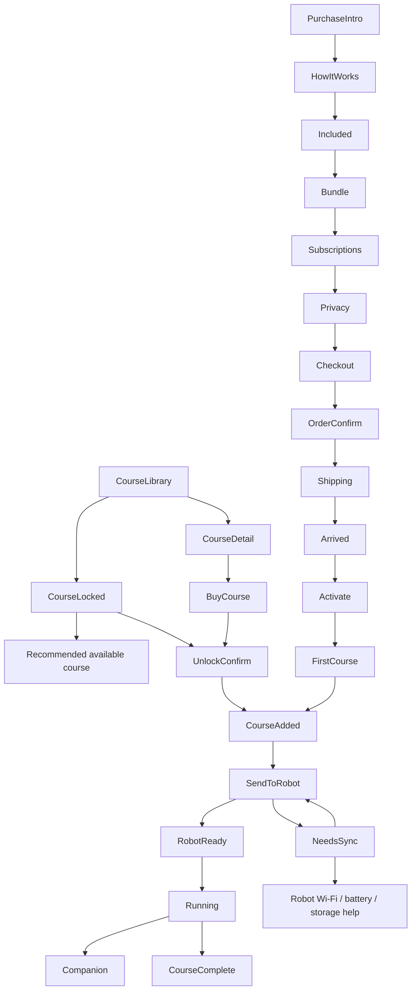

# Course Library + Purchase Flow Review

Date: 2026-05-14
Scope: `course-library`, `purchase`, robot send/sync states
Owning system: sys-16 mobile UX shell
Status: Review artifact, no production code changes

## Evidence Read

- `src/features/course-library/navigation.ts`
- `src/features/course-library/states.ts`
- `src/features/course-library/screens/*`
- `src/features/course-library/components/CourseCard.tsx`
- `src/features/course-library/components/courses.ts`
- `src/services/api/course-library.api.ts`
- `src/features/purchase/navigation.ts`
- `src/features/purchase/states.ts`
- `src/features/purchase/screens/*`
- `src/services/api/purchase.api.ts`
- `src/contracts/robot-state.ts`

## Commerce Flow Map

Primary path:
1. Parent discovers course in `CourseLibrary`.
2. Parent opens `CourseDetail` or `CourseLocked`.
3. Parent chooses free, owned, one-time, or subscription path.
4. Parent confirms through parent-only gate.
5. App sends course or lesson to Robot only after readiness checks.
6. App keeps queued/sync/running/complete states visible.

Anti-dark-pattern rules:
- Keep `Not now`, `Back`, or owned-course fallback visible on every commerce step before payment.
- Never present subscription as required when a one-time or included path exists.
- Show renewal/trial timing before checkout, not after checkout.
- Never expose price, checkout, or purchase pressure to child-facing screens.

## Course Card Spec

Required fields:

| Field | Purpose | Notes |
|---|---|---|
| Status chip | Parent sees entitlement/sync status quickly | `On Robot`, `Available`, `Locked`, `Needs sync`, `Ready today`, `Completed` |
| Title | Course identity | Short enough for one or two lines |
| Age range | Fit signal | Do not imply diagnosis or child ranking |
| Level | Parent-readable progression | Example: `Just starting`, `Building up` |
| Lesson count + duration | Effort expectation | Example: `28 lessons · 7 weeks` |
| Tags | What child practices | Limit visible tags to 3, show `+N` for overflow |
| Robot visual | Robot/course personality | Should not replace explicit status text |

Card actions:

| Course state | Tap target |
|---|---|
| `installed`, no progress | `SendToRobot` or `NeedsSync`, depending readiness |
| `installed`, progress complete/today done | `CourseComplete` or course progress summary |
| `not_installed`, free/included | `CourseDetail` |
| `not_installed`, paid | `CourseDetail` then `BuyCourse` |
| `locked` | `CourseLocked` |
| `needs_sync` | `NeedsSync` |

## Course Detail Spec

Required sections:

| Section | Required content |
|---|---|
| Header | title, age range, level, lesson/weeks count |
| Value | concrete learning goals, not inflated outcomes |
| What Robot teaches | 4-6 skills or topics |
| Parent note | short trust copy: daily play, no tests, no guaranteed quick results |
| Entitlement | included/free/one-time/subscription ownership |
| Robot readiness preview | whether Robot can accept course now |
| Primary CTA | state-specific action |
| Secondary CTA | back/skip/choose later |

CTA rules:
- Free/included: `Add to Robot`
- Owned but not synced: `Send to Robot`
- Paid one-time: `Buy this course`
- Subscription: `Choose course plan`
- Locked: `See why locked`
- Expired subscription: `Restore access` plus `Use owned courses`

## Locked / Buy / Checkout State Matrix

| Area | State | Parent-facing explanation | Primary action | Secondary action |
|---|---|---|---|---|
| Locked | skill progression | This course uses longer sentences or harder grammar than current course. | Try recommended course | Back to library |
| Locked | age fit | This course is designed for older learners. | See age-fit course | Back to library |
| Locked | prerequisite | Finish or practice prerequisite course first. | Open prerequisite | Unlock anyway behind parent gate |
| Locked | subscription expired | This course is paused because All Courses ended. Owned courses still work. | Restore subscription | Browse owned courses |
| Buy | free/included | Included with Robot, no payment. | Add to Robot | Back |
| Buy | one-time | Own this course permanently. No subscription. | Continue with one-time | Not now |
| Buy | subscription trial | Trial length, renewal date, monthly price, cancel path. | Continue with subscription | Choose one-time / no subscription |
| Buy | provider unavailable | Billing provider unavailable; order actions cannot run now. | Retry billing status | Back |
| Checkout | review | Itemized total, shipping, payment method, trial note. | Place order | Back before payment |
| Checkout | submitting | Payment in flight; prevent duplicate charge. | Disabled progress button | None until request resolves |
| Checkout | failed | Plain error and no blame. | Retry checkout | Change payment / back |
| Order | paid | Receipt, entitlement refresh, shipping next step. | Track delivery | Home |
| Order | fraud review | Payment received but order is under review. | Check status later | Contact support |
| Order | cancelled | Order cancelled, no course added. | Return to bundles | Home |

## Sync-To-Robot State Model

| State | Meaning | Required UI |
|---|---|---|
| `not_queued` | No selected lesson/course waiting | Course CTA remains available |
| `queued` | Parent selected course/lesson, not yet sent | Queue item, selected Robot, time added |
| `checking_ready` | App checks Robot status | Wi-Fi, battery, storage, entitlement checklist |
| `ready` | Robot can start lesson | `RobotReady`, lesson name, duration, readiness checklist |
| `syncing` | Content downloading to Robot | Progress count, do not navigate away silently |
| `sync_failed_offline` | Robot unavailable | Retry, Wi-Fi help, later option |
| `sync_failed_storage` | Not enough space | Manage storage, remove course, retry |
| `sync_failed_entitlement` | Course not owned or subscription expired | Restore subscription or choose owned course |
| `running` | Lesson active on Robot | Running state, companion option, no transcript |
| `complete_pending_sync` | Robot finished but app has not fetched summary | Refresh status, preserve lesson context |
| `complete_synced` | Summary synced | CourseComplete with next action |

Robot readiness checklist:
- Robot online.
- Battery above minimum or plugged in.
- Wi-Fi connected.
- Storage available.
- Course entitlement valid.
- Lesson package downloaded or resumable.

## Current UX Findings

Blocking before implementation:
- `listLibrary`, `sendCourseToRobot`, and `getRobotSyncStatus` throw undocumented-route errors in `src/services/api/course-library.api.ts`. These need backend contract confirmation before real send/sync behavior.
- Existing `NeedsSync` copy covers offline recovery, but sync failure needs distinct storage, entitlement, timeout, and retry states.
- `CourseLocked` explains one hardcoded Story Time reason. It should be data-driven per lock reason.
- `Subscriptions` has `No subscription` and billing retry. It does not yet model expired subscription recovery as its own user-visible state.

Positive patterns already present:
- Parent-only pricing language exists in `BuyCourse`.
- Purchase flow includes privacy, bundle, subscription, checkout, order, shipping, arrival, activation, and first-course steps.
- Retry affordances exist for checkout, order status, shipping status, and billing provider status.
- Running/Companion copy avoids transcript display and says audio is not saved.

## Copy Library

### Course discovery

| Context | EN | VI |
|---|---|---|
| Library intro | Pick what Robot teaches. Lessons play on Robot, not the phone. | Chọn nội dung Robot sẽ dạy. Bài học chạy trên Robot, không phải trên điện thoại. |
| Installed section | On your Robot now | Đang có trên Robot |
| Available section | Ready to add | Sẵn sàng để thêm |
| Locked section | For when ready | Dành cho lúc bé sẵn sàng |
| Empty | No courses yet. Check again after setup finishes. | Chưa có khóa học. Kiểm tra lại sau khi thiết lập xong. |
| Offline | Course Library is offline. Owned courses on Robot still work. | Thư viện khóa học đang ngoại tuyến. Khóa đã có trên Robot vẫn dùng được. |

### Locked course

| Context | EN | VI |
|---|---|---|
| Locked header | Locked for now | Tạm khóa |
| Skill reason | This course uses longer sentences. Robot will suggest it after your child practices the basics. | Khóa này dùng câu dài hơn. Robot sẽ gợi ý sau khi bé luyện phần cơ bản. |
| Age reason | This course is designed for older learners. Try the starter course first. | Khóa này dành cho bé lớn hơn. Hãy thử khóa khởi đầu trước. |
| Subscription reason | This course is paused because All Courses ended. Owned courses still work. | Khóa này tạm dừng vì gói All Courses đã hết hạn. Khóa đã sở hữu vẫn dùng được. |
| Unlock anyway | Parent unlock | Phụ huynh mở khóa |
| Safer CTA | Try this first | Thử khóa này trước |

### Buy and checkout

| Context | EN | VI |
|---|---|---|
| Buy intro | Add only if you want. Your child never sees prices. | Chỉ thêm nếu phụ huynh muốn. Bé không thấy giá. |
| One-time plan | Own this course forever. No subscription. | Sở hữu khóa này lâu dài. Không cần đăng ký tháng. |
| Subscription plan | All courses, including new ones. Cancel anytime in parent settings. | Tất cả khóa học, gồm khóa mới. Có thể hủy trong cài đặt phụ huynh. |
| Trial note | Trial ends on {date}. We remind you 2 days before renewal. | Dùng thử kết thúc vào {date}. Chúng tôi nhắc trước khi gia hạn 2 ngày. |
| Checkout legal | 30-day return. No renewal without notice. | Hoàn trả trong 30 ngày. Không gia hạn nếu chưa báo trước. |
| Checkout failed | Checkout did not finish. You were not charged unless an order appears below. | Thanh toán chưa hoàn tất. Phụ huynh chưa bị tính tiền trừ khi có đơn hàng bên dưới. |
| Provider unavailable | Billing is unavailable right now. Try again in a moment. | Thanh toán tạm thời chưa dùng được. Vui lòng thử lại sau. |

### Send, sync, running, complete

| Context | EN | VI |
|---|---|---|
| Send intro | Pick what Robot plays today. We will check Robot before sending. | Chọn bài Robot sẽ chơi hôm nay. Ứng dụng sẽ kiểm tra Robot trước khi gửi. |
| Readiness | Lesson loaded. Battery, Wi-Fi, and storage look ready. | Bài học đã sẵn sàng. Pin, Wi-Fi và bộ nhớ đều ổn. |
| Offline sync | Robot is offline. We will send this when Robot is back on Wi-Fi. | Robot đang ngoại tuyến. Nội dung sẽ được gửi khi Robot có Wi-Fi lại. |
| Storage failed | Robot needs more space before this course can sync. | Robot cần thêm bộ nhớ trước khi đồng bộ khóa này. |
| Entitlement failed | This course needs active access before it can sync. | Khóa này cần quyền truy cập hợp lệ trước khi đồng bộ. |
| Running | Your child is talking with Robot. Your phone can stay in your pocket. | Bé đang nói chuyện với Robot. Phụ huynh có thể cất điện thoại. |
| Privacy running | No transcript is shown. Audio is not saved. | Không hiển thị bản ghi lời nói. Âm thanh không được lưu. |
| Complete | Synced from Robot just now. Robot will revisit tricky words gently. | Vừa đồng bộ từ Robot. Robot sẽ nhẹ nhàng ôn lại từ còn khó. |

### Privacy and legal trust

| Context | EN | VI |
|---|---|---|
| Privacy heading | Your child's voice stays your child's. | Giọng nói của bé vẫn thuộc về bé. |
| No ads | No ads, ever. Robot never shows or hints at advertising. | Không quảng cáo. Robot không hiển thị hoặc gợi ý quảng cáo. |
| Parent purchases | Purchases and upgrades always require a parent step. | Mua và nâng cấp luôn cần bước xác nhận của phụ huynh. |
| Data minimization | We keep short lesson data so Robot knows what to practice next. | Chúng tôi chỉ lưu dữ liệu bài học ngắn để Robot biết cần luyện gì tiếp theo. |
| Offline listening | Robot listens only during a lesson. If it is offline, lessons stop. | Robot chỉ nghe trong bài học. Nếu ngoại tuyến, bài học dừng lại. |

## Acceptance Tests

### Discovery and detail

- [ ] Course cards expose status text, age range, level, lesson count, and learning tags.
- [ ] Locked course tap opens a locked explanation screen, not checkout.
- [ ] Locked course has a specific reason and a lower-friction recommended course.
- [ ] Course detail explains learning value without promising quick results.
- [ ] Course detail includes a parent-only note and a non-purchase escape.

### Purchase and subscription

- [ ] Buy flow includes one-time option when available.
- [ ] Subscription option shows monthly price, trial end, renewal notice, and cancel path before checkout.
- [ ] Checkout shows itemized total before payment submission.
- [ ] Checkout failure exposes retry and does not imply duplicate charge.
- [ ] Expired subscription state keeps owned courses usable and offers restore/update payment.
- [ ] Billing provider failure has retry and back path.
- [ ] Child-facing flow never includes price, subscription, checkout, or upsell copy.

### Send and sync

- [ ] Send action checks Robot readiness before showing `RobotReady`.
- [ ] Robot readiness shows Wi-Fi, battery, storage, entitlement, and download status.
- [ ] Offline sync failure preserves queued course and offers retry.
- [ ] Storage sync failure routes to storage management and retry.
- [ ] Entitlement sync failure routes to restore access or owned-course fallback.
- [ ] Running state has companion view but no transcript.
- [ ] Course completion distinguishes synced summary from pending sync.

### Privacy and accessibility

- [ ] Privacy copy is short, specific, and present before checkout.
- [ ] Running and Companion screens state that audio is not saved and no transcript is shown.
- [ ] Every purchase and sync action has accessible button labels.
- [ ] Error states use plain language and avoid blaming parent or child.

## Implementation Plan Seed

Suggested sequence:

1. Contract alignment: confirm content/course-library API routes for catalog, detail, send-to-robot, and sync status.
2. Data model: add lock reasons, entitlement state, subscription state, sync state, and robot readiness state to mobile-facing types.
3. Screen states: replace hardcoded lock/sync copy with state-specific copy.
4. Subscription recovery: add expired/past-due branch in `SubscriptionsScreen` and course access logic.
5. Sync reliability: split `NeedsSync` into offline, storage, entitlement, timeout, and retry states.
6. Tests: add unit tests for state mapping and render tests for critical copy/CTA combinations.
