# TBOT Mobile (tbot-design) — Use Case Diagram

> **DEPRECATED for active authoring.** See `docs/usecases/` for the active use-case authoring (per-domain bodies, backend mapping, edge cases, cross-domain edges, hot-UC dossiers). This file is preserved as the **historical canonical UC ID source** per ADR-0005 D2 — every `UC-LL-NN` ID below remains the anchor key in `docs/usecases/reference/use-case-index.json`.
>
> Updates to UC IDs or the §2 catalog still happen here (single source); per-UC content updates happen in the per-domain `docs/usecases/domains/<d>/use-cases.md` files.

Source: React/JSX prototype in `src/features/`, `src/services/`, `src/store/`.
Method: code-evidence only. No invented features. Anything ambiguous is marked.

---

## 1. ACTORS

| Actor | Justification (code evidence) |
|---|---|
| **Child (Kid User)** | Default actor for kid-mode screens: `src/features/home/HomeHubPage.jsx`, `src/features/lesson-session/*`. No auth gate at router level; UI/copy is child-targeted. |
| **Parent** | Gated by numeric speed bumps: `src/features/parent/ParentGatePage.jsx` (3-digit match) and `src/features/course-library/UnlockConfirmModal.jsx` (4-digit code `7351`). Owns parent-only screens. |
| **Guest (Unauthenticated User)** | `src/features/onboarding/*` and `src/features/auth/LoginPage.jsx` — pre-login surface. Auth store state `anonymous` (`src/store/auth.store.js`). |
| **Authenticated User** | Auth store state `authenticated` (`src/store/auth.store.js`); selector `isAuthenticated()`. |
| **Robot Device** *(external system)* | Pairing scan, firmware OTA, course sync, LCD turns. Evidence: `src/features/device/Pair*.jsx`, `src/features/robot-mgmt/*`, `src/services/api/device.api.js`. |
| **Realtime Voice Service** *(external system)* | `openRealtime(sessionId)` in `src/services/websocket/realtime.js`. Triggered from `ConnectingPage.jsx`. |
| **Google OAuth** *(external system)* | "Continue with Google" button in `src/features/auth/LoginPage.jsx`. |
| **Apple Sign-In** *(external system)* | "Continue with Apple" button in `src/features/auth/LoginPage.jsx`. |
| **Payment Provider** *(external system)* | Apple Pay + Visa rows in `src/features/purchase/CheckoutPage.jsx`; stub `processPayment()` in `purchase.api.js`. Specific provider NOT CONFIRMED IN SOURCE CODE. |
| **OS / Device OS** *(external)* | iOS microphone permission sheet modeled in `src/features/onboarding/MicAskPage.jsx`. |
| **Wi-Fi Network** *(external)* | Robot Wi-Fi provisioning at `src/features/device/PairWifiPage.jsx` + `PairWifiPasswordPage.jsx`. |

---

## 2. USE CASE LIST (grouped by domain)

### AUTH
- UC-A01 View Splash / Welcome (`onb_splash`, `onb_welcome`)
- UC-A02 Sign Up with Email/Password (`LoginPage` mode=signup)
- UC-A03 Log In with Email/Password (`LoginPage` mode=login)
- UC-A04 Continue with Google (delegates to Google OAuth)
- UC-A05 Continue with Apple (delegates to Apple Sign-In)
- UC-A06 Reset Password — button only, target `onb_login` (no API call observed)
- UC-A07 Recover from Login Error (`onb_login_error`)
- UC-A08 Set Up Child Profile (buddy + level) — `ChildProfilePage`
- UC-A09 Token Refresh — store action `beginRefresh`/`refreshSuccess` (`auth.store.js`); UI trigger NOT CONFIRMED IN SOURCE CODE
- UC-A10 Logout — store action `logout`; UI trigger NOT CONFIRMED IN SOURCE CODE

### ONBOARDING
- UC-O01 Run Intro Tutorial (auto-advancing `onb_intro_listen` → `_speak` → `_retry` → `_celebrate`)
- UC-O02 View Parent Trust Intro (`onb_trust`)
- UC-O03 Grant Microphone Permission (`MicAskPage` — invokes OS sheet)
- UC-O04 Enter First Lesson (`FirstLessonEntryPage` → `lesson_ready`)

### KID HUB / HOME
- UC-H01 View Home Hub (6 state variants: idle/greet/daily/done/mic/offline)
- UC-H02 Tap Robot for Greeting (`onRobotTap` ephemeral bubble)
- UC-H03 Start Today's Lesson (state-driven CTA → `lesson_ready`)
- UC-H04 Open Course (kid) → `course`
- UC-H05 Open Review → `review_entry`
- UC-H06 Open Today's Progress → `today_progress`
- UC-H07 Open Kid Settings → `kid_settings`
- UC-H08 Enter Parent Space (initiates parent gate)

### COURSE BROWSE (kid-side)
- UC-C01 Browse Course Tree (`CoursePage`)
- UC-C02 View Level (`LevelPage`) — locked levels gated client-side
- UC-C03 View Unit (`UnitPage`) — locked units gated
- UC-C04 View Lesson List (`LessonListPage`)
- UC-C05 View Lesson Detail (`LessonDetailPage`)
- UC-C06 Start Lesson From Detail → `lesson_ready`
- UC-C07 Start Review (`ReviewEntryPage`) → `lesson_ready`
- UC-C08 Start Daily Mission (`DailyMissionPage`) → `lesson_ready`

### LESSON SESSION (voice + activity loop)
- UC-L01 Start Voice Session (`LessonReadyPage` "I'm ready!")
- UC-L02 Connect to Realtime Voice (`ConnectingPage` auto-advance — system call to Realtime Voice Service via `openRealtime`)
- UC-L03 Receive Robot Greeting (`GreetingPage`)
- UC-L04 Begin Activity (`ActivityIntroPage`)
- UC-L05 Listen to Robot Speech (`RobotSpeakingPage`)
- UC-L06 Listen for Child Speech (`RobotListeningPage`)
- UC-L07 Record Child Utterance (`UserSpeakingPage` — mic on/off)
- UC-L08 Process Utterance (`ThinkingPage` — auto-advance system response)
- UC-L09 Receive Success Feedback (`SuccessPage`)
- UC-L10 Receive Gentle Correction (`GentlePage`)
- UC-L11 Receive Retry Prompt (`RetryPage`)
- UC-L12 Receive Silence Prompt (`SilencePage`)
- UC-L13 Receive Off-topic Redirect (`OfftopicPage`)
- UC-L14 Handle Barge-in (`BargeinPage`)
- UC-L15 Complete Activity (`ActivityDonePage`)
- UC-L16 Complete Lesson (`LessonDonePage`)
- UC-L17 Confirm Exit Lesson (`ExitConfirmPage`)
- UC-L18 Reconnect Voice (`ReconnectingPage`)
- UC-L19 Recover from Audio Error (`AudioErrorPage`)
- UC-L20 Trigger Safety Fallback (`SafetyPage` — system-initiated)
- UC-L21 Report Safety Event — `reportSafetyEvent()` API stub

### PROGRESS
- UC-P01 View Today's Progress (`TodayProgressPage`)
- UC-P02 View Words Practiced (`WordsPracticedPage`)
- UC-P03 View Lesson Summary (`LessonSummaryPage`)
- UC-P04 View Review Needed (`ReviewNeededPage`)
- UC-P05 View Celebration (`CelebrationPage`)

### PARENT (gated)
- UC-PR01 Pass Parent Gate (numeric speed bump, `ParentGatePage`)
- UC-PR02 View Parent Summary (`ParentSummaryPage`)
- UC-PR03 View Practiced Today (parent view, `ParentTodayPage`)
- UC-PR04 View Past 30 Days (`ParentHistoryPage`)
- UC-PR05 View Safety & Privacy (`ParentSafetyPage`)
- UC-PR06 Configure Parent Settings (`ParentSettingsPage`)
- UC-PR07 Open Help & FAQ (`HelpFaqPage`)

### COURSE LIBRARY (parent-gated commerce + sync)
- UC-CL01 Browse Library (`CourseLibraryPage`)
- UC-CL02 View Course Detail (`CourseDetailPage`)
- UC-CL03 Buy / Unlock Course (`BuyCoursePage`)
- UC-CL04 Confirm Unlock with Numeric Code (`UnlockConfirmModal` — speed-bump auth)
- UC-CL05 Course Added to Robot (`CourseAddedPage`)
- UC-CL06 Send Lesson to Robot (`SendToRobotPage`)
- UC-CL07 Confirm Robot Ready (`RobotReadyPage`)
- UC-CL08 Monitor Lesson Running on Robot (`RunningPage`)
- UC-CL09 View Companion (live session view) (`CompanionPage`)
- UC-CL10 View Lesson Complete (synced) (`CourseCompletePage`)
- UC-CL11 Resync Robot (`NeedsSyncPage`)
- UC-CL12 View Locked Course (`CourseLockedPage`)

### PURCHASE FUNNEL (hardware + subscription)
- UC-BU01 View Robot Overview (`PurchaseIntroPage`)
- UC-BU02 View How It Works (`HowItWorksPage`)
- UC-BU03 View What's Included (`IncludedPage`)
- UC-BU04 Pick Bundle (`BundlePage`)
- UC-BU05 Pick Subscription (`SubscriptionsPage`)
- UC-BU06 Review Privacy & Trust (`PrivacyPage`)
- UC-BU07 Place Order / Checkout (`CheckoutPage`)
- UC-BU08 Pay with Apple Pay (delegates to Payment Provider)
- UC-BU09 Pay with Card (delegates to Payment Provider)
- UC-BU10 View Order Confirmation (`OrderConfirmPage`)
- UC-BU11 Track Shipping (`ShippingPage`)
- UC-BU12 Confirm Robot Arrived (`ArrivedPage`)
- UC-BU13 Activate Robot with Code (`ActivatePage`)
- UC-BU14 Add First Course (`FirstCoursePage`)

### DEVICE PAIRING (parent / setup)
- UC-DP01 View Device Overview (`DeviceOverviewPage`)
- UC-DP02 Add New Robot (`PairAddPage`)
- UC-DP03 Power-on Robot Confirm (`PairIntroPage`)
- UC-DP04 Scan for Robot (`PairSearchPage` — radio scan, BLE/Wi-Fi technology NOT CONFIRMED IN SOURCE CODE)
- UC-DP05 Identify Robot (`PairFoundPage`)
- UC-DP06 Confirm Pairing Code (`PairCodePage`)
- UC-DP07 Pick Wi-Fi Network (`PairWifiPage`) — interacts with Wi-Fi Network actor
- UC-DP08 Enter Wi-Fi Password (`PairWifiPasswordPage`)
- UC-DP09 Connect Robot to Wi-Fi (`PairConnectingPage`)
- UC-DP10 Pairing Success (`PairSuccessPage`)
- UC-DP11 Pairing Failed Recovery (`PairFailedPage`)
- UC-DP12 Pair Offline Mode (`PairOfflinePage`)
- UC-DP13 Rename Robot & Pick Buddy (`PairRenamePage`)
- UC-DP14 Pairing First Lesson (`PairFirstLessonPage`)

### DEVICE MANAGEMENT (post-pair)
- UC-DM01 View Device Home (`DeviceHomePage`)
- UC-DM02 View Live Session Monitor (`DeviceSessionPage`)
- UC-DM03 Find My Robot — Make Chime (`DeviceLostPage`)
- UC-DM04 Update Firmware (`DeviceFirmwarePage`)
- UC-DM05 View LCD Face Library (`dv_lcd`)
- UC-DM06 View One Lesson Turn (`dv_lcd_turn`)

### ROBOT MANAGEMENT (parent diagnostics)
- UC-RM01 View My Robot (`MyRobotPage`)
- UC-RM02 View Robot Status (`RobotStatusPage`)
- UC-RM03 View Battery (`rm_battery`)
- UC-RM04 View Wi-Fi (`rm_wifi`)
- UC-RM05 View Installed Courses (`RobotStoragePage`)
- UC-RM06 Update Robot Software (`RobotFirmwarePage`)
- UC-RM07 Adjust Sound & Volume (`RobotSoundPage`)
- UC-RM08 Run Microphone Test (`MicTestPage`)
- UC-RM09 Run Speaker Test (`SpeakerTestPage`)
- UC-RM10 Factory Reset (`FactoryResetPage`)
- UC-RM11 View Offline Help (`OfflineHelpPage`)
- UC-RM12 Contact Support (`SupportPage`)

### FALLBACK / SAFETY / RECOVERY
- UC-F01 View Network Error (`NetworkErrorPage`)
- UC-F02 View Mic Missing (`MicMissingPage`)
- UC-F03 Audio Permission Recovery (`AudioRecoveryPage`)
- UC-F04 View Voice Failed (`VoiceFailedPage`)
- UC-F05 Resume Lesson (`LessonResumePage`)
- UC-F06 View Reconnecting Overlay (`ReconnectingOverlay`)
- UC-F07 Safety Redirect (`SafetyRedirectPage`)
- UC-F08 View Generic App Error (`AppErrorPage`)

---

## 3. USE CASE DIAGRAM (PlantUML)

```plantuml
@startuml TBOT-Mobile-UseCases
left to right direction
skinparam packageStyle rectangle
skinparam actorStyle awesome

actor Guest
actor "Authenticated User" as AuthUser
actor Child
actor Parent
actor "Robot Device" as Robot <<external>>
actor "Realtime Voice Service" as Voice <<external>>
actor "Google OAuth" as Google <<external>>
actor "Apple Sign-In" as Apple <<external>>
actor "Payment Provider" as Pay <<external>>
actor "Device OS" as OS <<external>>
actor "Wi-Fi Network" as WiFi <<external>>

AuthUser --|> Guest
Child --|> AuthUser
Parent --|> AuthUser

' ---------- AUTH & ONBOARDING ----------
package "Auth & Onboarding" {
  usecase "View Splash / Welcome" as UC_A01
  usecase "Run Intro Tutorial" as UC_O01
  usecase "Grant Mic Permission" as UC_O03
  usecase "Sign Up (email)" as UC_A02
  usecase "Log In (email)" as UC_A03
  usecase "Continue with Google" as UC_A04
  usecase "Continue with Apple" as UC_A05
  usecase "Recover Login Error" as UC_A07
  usecase "Set Up Child Profile" as UC_A08
  usecase "Refresh Token" as UC_A09
  usecase "Logout" as UC_A10
}

Guest --> UC_A01
Guest --> UC_O01
Guest --> UC_O03
Guest --> UC_A02
Guest --> UC_A03
Guest --> UC_A04
Guest --> UC_A05
Guest --> UC_A07
Guest --> UC_A08
AuthUser --> UC_A09
AuthUser --> UC_A10
UC_A04 ..> Google : <<delegate>>
UC_A05 ..> Apple : <<delegate>>
UC_O03 ..> OS : <<delegate>>

' ---------- KID HUB ----------
package "Kid Hub" {
  usecase "View Home Hub" as UC_H01
  usecase "Tap Robot Greeting" as UC_H02
  usecase "Start Today's Lesson" as UC_H03
  usecase "Open Course" as UC_H04
  usecase "Open Review" as UC_H05
  usecase "Open Today's Progress" as UC_H06
  usecase "Open Kid Settings" as UC_H07
  usecase "Enter Parent Space" as UC_H08
}
Child --> UC_H01
Child --> UC_H02
Child --> UC_H03
Child --> UC_H04
Child --> UC_H05
Child --> UC_H06
Child --> UC_H07
Child --> UC_H08

' ---------- COURSE BROWSE ----------
package "Course Browse" {
  usecase "Browse Course Tree" as UC_C01
  usecase "View Level" as UC_C02
  usecase "View Unit" as UC_C03
  usecase "View Lesson List" as UC_C04
  usecase "View Lesson Detail" as UC_C05
  usecase "Start Review" as UC_C07
  usecase "Start Daily Mission" as UC_C08
}
Child --> UC_C01
Child --> UC_C02
Child --> UC_C03
Child --> UC_C04
Child --> UC_C05
Child --> UC_C07
Child --> UC_C08

' ---------- LESSON SESSION ----------
package "Lesson Session" {
  usecase "Start Voice Session" as UC_L01
  usecase "Connect Realtime Voice" as UC_L02
  usecase "Listen to Robot" as UC_L05
  usecase "Speak to Robot" as UC_L07
  usecase "Process Utterance" as UC_L08
  usecase "Receive Feedback" as UC_L09
  usecase "Handle Barge-in" as UC_L14
  usecase "Complete Activity" as UC_L15
  usecase "Complete Lesson" as UC_L16
  usecase "Confirm Exit" as UC_L17
  usecase "Reconnect Voice" as UC_L18
  usecase "Recover Audio Error" as UC_L19
  usecase "Trigger Safety Fallback" as UC_L20
  usecase "Report Safety Event" as UC_L21
}
Child --> UC_L01
Child --> UC_L05
Child --> UC_L07
Child --> UC_L09
Child --> UC_L14
Child --> UC_L15
Child --> UC_L16
Child --> UC_L17
Child --> UC_L18
Child --> UC_L19
UC_L01 ..> UC_L02 : <<include>>
UC_L02 ..> Voice : <<delegate>>
UC_L07 ..> UC_L08 : <<include>>
UC_L08 ..> Voice : <<delegate>>
UC_L20 ..> UC_L21 : <<include>>

' ---------- PROGRESS ----------
package "Progress" {
  usecase "View Today's Progress" as UC_P01
  usecase "View Words Practiced" as UC_P02
  usecase "View Lesson Summary" as UC_P03
  usecase "View Review Needed" as UC_P04
  usecase "View Celebration" as UC_P05
}
Child --> UC_P01
Child --> UC_P02
Child --> UC_P03
Child --> UC_P04
Child --> UC_P05

' ---------- PARENT (gated) ----------
package "Parent Space" {
  usecase "Pass Parent Gate" as UC_PR01
  usecase "View Parent Summary" as UC_PR02
  usecase "View Today (parent)" as UC_PR03
  usecase "View 30-Day History" as UC_PR04
  usecase "View Safety & Privacy" as UC_PR05
  usecase "Configure Parent Settings" as UC_PR06
  usecase "Open Help & FAQ" as UC_PR07
}
UC_H08 ..> UC_PR01 : <<include>>
Parent --> UC_PR02
Parent --> UC_PR03
Parent --> UC_PR04
Parent --> UC_PR05
Parent --> UC_PR06
Parent --> UC_PR07
UC_PR02 ..> UC_PR01 : <<include>>

' ---------- COURSE LIBRARY (commerce + sync) ----------
package "Course Library" {
  usecase "Browse Library" as UC_CL01
  usecase "View Course Detail" as UC_CL02
  usecase "Buy / Unlock Course" as UC_CL03
  usecase "Confirm Unlock (PIN)" as UC_CL04
  usecase "Course Added to Robot" as UC_CL05
  usecase "Send Lesson to Robot" as UC_CL06
  usecase "Robot Ready" as UC_CL07
  usecase "Monitor Lesson on Robot" as UC_CL08
  usecase "Companion View" as UC_CL09
  usecase "Lesson Complete (synced)" as UC_CL10
  usecase "Resync Robot" as UC_CL11
}
Parent --> UC_CL01
Parent --> UC_CL02
Parent --> UC_CL03
Parent --> UC_CL06
Parent --> UC_CL08
Parent --> UC_CL11
UC_CL03 ..> UC_CL04 : <<include>>
UC_CL06 ..> Robot : <<delegate>>
UC_CL08 ..> Robot : <<delegate>>
UC_CL11 ..> Robot : <<delegate>>

' ---------- PURCHASE FUNNEL ----------
package "Purchase Funnel" {
  usecase "View Robot Overview" as UC_BU01
  usecase "Pick Bundle" as UC_BU04
  usecase "Pick Subscription" as UC_BU05
  usecase "Place Order / Checkout" as UC_BU07
  usecase "Pay with Apple Pay" as UC_BU08
  usecase "Pay with Card" as UC_BU09
  usecase "View Order Confirmation" as UC_BU10
  usecase "Track Shipping" as UC_BU11
  usecase "Activate Robot" as UC_BU13
  usecase "Add First Course" as UC_BU14
}
Parent --> UC_BU01
Parent --> UC_BU04
Parent --> UC_BU05
Parent --> UC_BU07
Parent --> UC_BU11
Parent --> UC_BU13
Parent --> UC_BU14
UC_BU07 ..> UC_BU08 : <<extend>>
UC_BU07 ..> UC_BU09 : <<extend>>
UC_BU08 ..> Pay : <<delegate>>
UC_BU09 ..> Pay : <<delegate>>
UC_BU13 ..> Robot : <<delegate>>

' ---------- DEVICE PAIRING ----------
package "Device Pairing" {
  usecase "Add New Robot" as UC_DP02
  usecase "Scan for Robot" as UC_DP04
  usecase "Confirm Pairing Code" as UC_DP06
  usecase "Pick Wi-Fi" as UC_DP07
  usecase "Enter Wi-Fi Password" as UC_DP08
  usecase "Connect Robot to Wi-Fi" as UC_DP09
  usecase "Pairing Success" as UC_DP10
  usecase "Pairing Failed Recovery" as UC_DP11
  usecase "Rename & Pick Buddy" as UC_DP13
}
Parent --> UC_DP02
Parent --> UC_DP04
Parent --> UC_DP06
Parent --> UC_DP07
Parent --> UC_DP11
Parent --> UC_DP13
UC_DP04 ..> Robot : <<delegate>>
UC_DP07 ..> WiFi : <<delegate>>
UC_DP09 ..> Robot : <<delegate>>
UC_DP09 ..> WiFi : <<delegate>>

' ---------- ROBOT MGMT ----------
package "Robot Management" {
  usecase "View My Robot" as UC_RM01
  usecase "View Robot Status" as UC_RM02
  usecase "Update Robot Software" as UC_RM06
  usecase "Adjust Sound" as UC_RM07
  usecase "Run Mic Test" as UC_RM08
  usecase "Run Speaker Test" as UC_RM09
  usecase "Factory Reset" as UC_RM10
  usecase "Find My Robot (chime)" as UC_DM03
  usecase "Contact Support" as UC_RM12
}
Parent --> UC_RM01
Parent --> UC_RM02
Parent --> UC_RM06
Parent --> UC_RM07
Parent --> UC_RM08
Parent --> UC_RM09
Parent --> UC_RM10
Parent --> UC_DM03
Parent --> UC_RM12
UC_RM06 ..> Robot : <<delegate>>
UC_RM08 ..> Robot : <<delegate>>
UC_RM09 ..> Robot : <<delegate>>
UC_RM10 ..> Robot : <<delegate>>
UC_DM03 ..> Robot : <<delegate>>

' ---------- FALLBACK / SAFETY ----------
package "Fallback & Safety" {
  usecase "Network Error" as UC_F01
  usecase "Mic Missing" as UC_F02
  usecase "Audio Recovery" as UC_F03
  usecase "Voice Failed" as UC_F04
  usecase "Resume Lesson" as UC_F05
  usecase "Reconnecting Overlay" as UC_F06
  usecase "Safety Redirect" as UC_F07
  usecase "Generic App Error" as UC_F08
}
Child --> UC_F01
Child --> UC_F02
Child --> UC_F04
Child --> UC_F05
Child --> UC_F07
Child --> UC_F08
UC_F02 ..> UC_F03 : <<extend>>
UC_F04 ..> UC_F05 : <<extend>>

@enduml
```

---

## 4. ASSUMPTIONS CHECK

| Item | Status |
|---|---|
| `Child` vs `Parent` actor distinction | INFERRED from UI gating screens (`parent_gate`, `cl_unlock_confirm`). NO ROLE FIELD in code; gates are speed-bumps, not RBAC. |
| Auth API contracts (`login`, `logout`, etc.) | Stubs only in `src/services/api/auth.api.js` — request/response shapes NOT CONFIRMED IN SOURCE CODE. |
| Token refresh trigger | Auth store has actions but **no UI/timer trigger** observed → UC-A09 marked but actor link weak. |
| Logout UI affordance | `logout()` action exists in store but **no button** found in any screen → UC-A10 listed for completeness. |
| Pairing radio (BLE vs Wi-Fi probe) | UI shows "within 3 meters" + radio animation. Underlying transport NOT CONFIRMED IN SOURCE CODE. |
| Payment provider identity (Stripe? Adyen?) | NOT CONFIRMED IN SOURCE CODE — only `processPayment()` stub. |
| Realtime voice provider | NOT CONFIRMED IN SOURCE CODE — `openRealtime()` stub in `src/services/websocket/realtime.js`. |
| Course-lock enforcement | Client-side only (`l.state === 'locked'`). Server-side enforcement NOT CONFIRMED IN SOURCE CODE. |
| Idempotency-Key usage | Confirmed in `src/services/http/idempotency.js`; specific endpoints attached at NOT CONFIRMED IN SOURCE CODE. |
| Reset Password (UC-A06) | Button only — button target is `onb_login`, no API call. → UNKNOWN USE CASE (label only). |
| Parent gate as RBAC | NOT a real auth boundary — speed bump only. Treat as parent-mode toggle, not security control. |
| Push / notifications, analytics, CSAT | NOT CONFIRMED IN SOURCE CODE. |
| Multi-child accounts / family sharing | NOT CONFIRMED IN SOURCE CODE. |
| Account deletion / data export (COPPA-relevant) | NOT CONFIRMED IN SOURCE CODE. |

---

## 5. SCOPE LIMITATION NOTE

This catalog reflects the **`tbot-design` JSX prototype only**. It does NOT cover:

- Server-side capabilities (any backend logic beyond `*.api.js` stub names is unverified)
- Real-time transport semantics (WebRTC vs WebSocket vs SIP — none specified in code)
- Robot firmware behavior (LCD render pipeline modeled visually only)
- Coppa / parental consent flows beyond the screens listed
- Any analytics, telemetry, push notification, or A/B-test surface
- Account / subscription lifecycle management beyond initial purchase
- Multi-locale enrollment beyond i18n string keys
- Search, recommendation, or personalization use cases
- Admin / customer-support backend tools (no Admin actor present in code)

If a use case is not in section 2, **NOT CONFIRMED IN SOURCE CODE**.
